# ReteKey IME

[English](README.md) · **한국어**

표준 IME 동작, 물리 키보드 친화성, 효율적인 한글 입력에 집중한 MIT 라이선스 안드로이드 한글 키보드.
서드파티 런타임 의존성 없는 순수 자바로 작성했으며, 릴리즈 APK는 약 460 KB로 대부분이 한자 표다.

> 기준 문서는 [영어판 README](README.md)이며, 이 문서는 그 번역본이다.

## 차례

- [내려받기](#내려받기)
- [안드로이드 버전 지원 범위](#안드로이드-버전-지원-범위)
- [기능](#기능)
- [자판 배열](#자판-배열)
- [플로팅 키보드](#플로팅-키보드)
- [한자 변환](#한자-변환)
- [물리 키보드](#물리-키보드)
- [설정](#설정)
- [테마](#테마)
- [구조](#구조)
- [빌드](#빌드)
- [문서](#문서)
- [라이선스](#라이선스)

## 내려받기

**[⬇ 안드로이드 9 이상](https://github.com/rubidus-api/retekey_apk/releases/latest/download/retekey.apk)**
&nbsp;·&nbsp;
**[⬇ 안드로이드 4.0 이상](https://github.com/rubidus-api/retekey_apk/releases/latest/download/retekey-legacy.apk)**
&nbsp;·&nbsp; [전체 릴리즈](https://github.com/rubidus-api/retekey_apk/releases)

현재 릴리즈: **v0.1.68** —
[retekey-0.1.68.apk](https://github.com/rubidus-api/retekey_apk/releases/download/v0.1.68/retekey-0.1.68.apk)

설치한 뒤 *설정 → 키보드*에서 ReteKey를 활성화하고 기본 입력기로 선택한다. 앱 실행 화면에 두 단계로 가는
바로가기와, 키보드를 시험해 볼 입력란이 있다.

## 안드로이드 버전 지원 범위

같은 앱의 빌드가 둘이다. 기기가 받는 쪽을 설치하면 된다. 패키지 이름이 같아서 한쪽이 다른 쪽을
대체한다.

| 빌드 | 동작 범위 | APK |
|---|---|---|
| **modern** | 안드로이드 9 ~ 16 (API 28~36) | `retekey.apk` |
| **legacy** | 안드로이드 4.0 ~ 16 (API 14~36) | `retekey-legacy.apk` |

둘 다 같은 소스에서 나오고 타깃 API 36 이며, 플랫폼이 허락하는 한 동작이 같다. 빌드를 나눈 이유는
안드로이드 4 까지 내려가려면 몇 군데에서 옛길을 택해야 하는데, 요즘 폰까지 그 길로 보낼 이유가 없기
때문이다.

### legacy 빌드에서 달라지는 것

세 가지뿐이고, 별도 코드가 아니라 모두 기기 쪽 버전 검사 뒤에 있다.

| 구버전에서 | 어떻게 되나 | 기준 |
|---|---|---|
| 진동 | 세기 조절 없이 고정 세기. `VibrationEffect` 가 API 26 이고, 그 이전 호출은 지속 시간만 받는다 | API 26 미만 |
| 슬라이더 | 키보드 높이·투명도 슬라이더가 내부적으로 0 부터 시작해 값을 옮겨 쓴다. `SeekBar.setMin` 이 API 26 | API 26 미만 |
| 삭제 | 코드포인트 삭제가 없어, 구형 에디터용으로 이미 쓰던 UTF-16 대체 경로가 처리한다. 음절·이모지가 한 번에 지워지는 결과는 같다 | API 24 미만 |
| 그림자 | 한자 창에 그림자가 없다 (`PopupWindow.setElevation` 이 API 21) | API 21 미만 |
| 테마 | 화면이 Material 대신 플랫폼 기본 테마를 쓴다 | API 21 미만 |

그 밖의 전부 — 다섯 자판, 2벌식과 12키 조합기, 한자 변환, 플로팅 키보드, 물리 키보드, 자동반복,
테마 — 는 두 빌드에서 같은 코드다. `java.time` 도 `java.util.function` 도 라이브러리 desugaring 도
쓰지 않으며, 그래서 legacy APK 가 modern 보다 오히려 *작다*.

안드로이드 4.0 이 하한인 이유는 고집이 아니라 구조다. API 11 미만에는 `InputMethodSubtype` 이 없고
(한/영 모드가 없다), `KeyEvent.isCtrlPressed` 와 F 키 코드가 없으며(물리 키보드 지원이 없다),
`Insets.touchableRegion` 이 없다(플로팅 키보드가 없다). API 9 미만에는 `getSelectedText` 도
`MotionEvent.getActionMasked` 도 없다. 안드로이드 2 로 내려가는 것은 이 키보드의 이식이 아니라 훨씬
작은 다른 키보드를 만드는 일이 된다.

안드로이드 12(API 31) 이상은 두 빌드 모두 Material You 팔레트를 쓰고, 그 아래는 둘 다 다듬어 둔
라이트/다크 팔레트로 물러난다.

### 기기에서

릴리즈 빌드를 에뮬레이터에서 돌려 찍은 화면이다. modern 은 안드로이드 10, legacy 는 안드로이드 4.4.

| | |
|---|---|
| 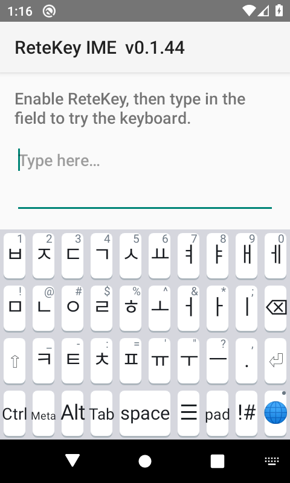 | 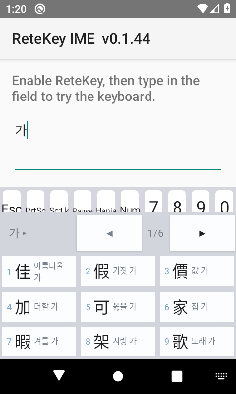 |
| 2벌식 — 입체 키와 모서리의 홀드 문자 | 한자 창 — 키보드 폭, 훈음이 글자 오른쪽에, 한 페이지 아홉 개 |
| 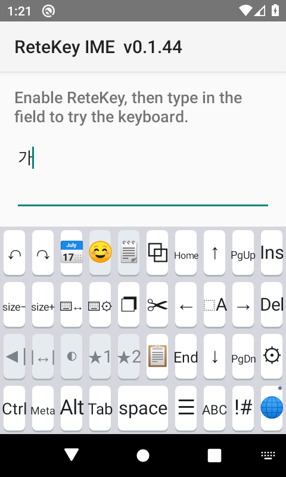 | 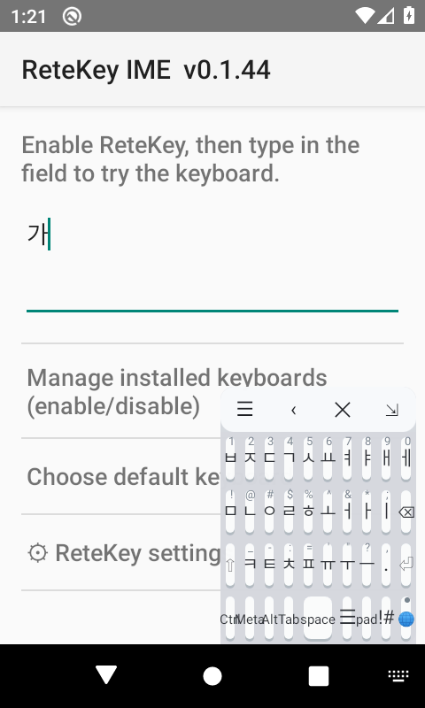 |
| ☰ 페이지 — 편집·커서 키가 오른쪽, 설정은 구석에 | 플로팅 키보드 — 반투명하게 자기 절반 안에 |

### 안드로이드 4.4 에서의 legacy 빌드

아래는 KitKat 에뮬레이터에서 legacy APK 를 돌려 찍은 실제 화면이다. 렌더한 그림도 아니고, modern
빌드에 이름만 바꿔 붙인 것도 아니다.

| | |
|---|---|
| 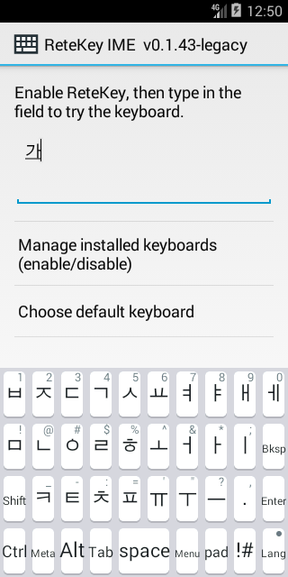 | 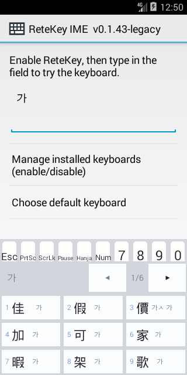 |
| 2013년 플랫폼 위의 2벌식과 홀드 문자 | 한자 창 — 키보드 폭 전체, 훈음이 글자 오른쪽에, 여섯 페이지 |
| 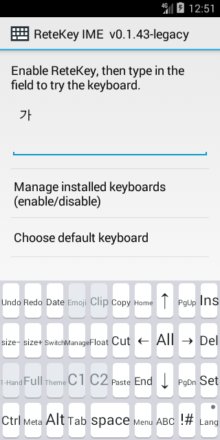 | 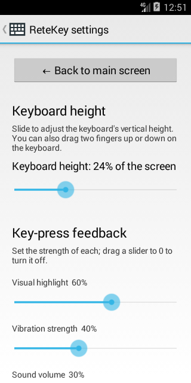 |
| ☰ 페이지 — 편집·커서 키가 오른쪽, 설정은 구석에 | 그 구석 키로 연 설정 화면 |

라벨이 기호 대신 낱말로 보이는데, 그것이 legacy 빌드가 제 일을 하는 모습이다. 앞선 시도의
스크린샷에서는 메뉴 키가 **빈 칸**으로 나왔다. 안드로이드 4.4 에는 ☰ 글꼴이 없기 때문이다. 그 기호들이
믿을 만해지는 버전 아래에서는 아무것도 그리지 않는 대신 `Menu`, `Copy`, `Bksp`, `Lang` 이라고 쓴다.

### 실제로 돌려 본 것

| | 버전 | 방법 |
|---|---|---|
| 자동 검증 | 안드로이드 13 — API 33 | AOSP x86_64 에뮬레이터, IME 수명주기 테스트 |
| 수동 검증 | 안드로이드 13 — API 33 | 갤럭시 노트20, 이 프로젝트의 기준 기기 |
| 수동 검증 | 안드로이드 13 — API 33 | 같은 에뮬레이터에서 legacy 빌드 |
| 수동 검증 | **안드로이드 4.4 — API 19** | KitKat 에뮬레이터에서 legacy 빌드: 한글 입력·한자 변환·설정 화면 |

위 표가 실제 실행이 덮은 버전이다. 나머지 구간은 구성상 지원된다 — 각 빌드의 하한에서 앱이 호출하는
플랫폼 API 는 모두 존재하고, 그렇지 않은 것은 명시적인 버전 검사 뒤에 있다. 린트도 두 하한 모두에서
에러 0 이다.

## 기능

- **다섯 가지 자판** — 두벌식·QWERTY·드보락, 그리고 12키 방식인 천지인·나랏글. 🌐 키가 켜 둔 자판을
  정해 둔 순서로 순환하며, 길게 누르면 한자로 변환한다.
- **상태를 가진 2벌식 한글 조합기**: 겹모음·겹받침, 도깨비불(받침 이동), 되돌리는 백스페이스
  (닭 → 달 → 다).
- **양방향 한자 변환**: 훈음 표시, 페이지 넘김, 숫자키 선택. 어떤 키보드를 쓰든 별도의 창으로 뜬다.
- **플로팅 키보드**: 태블릿 가로 모드용. 화면 절반 안에 갇힌 반투명 패널을 끌어 옮기고 크기를 바꾸며,
  키 하나로 반대편에 거울처럼 옮긴다.
- **물리 키보드 지원**: 한/영·한자 키를 사용자가 지정, 조합키 지원, 블루투스·유선 키보드용 2벌식 매핑.
- **키 자동 반복**: 스페이스·엔터·백스페이스·화살표에 적용되며 시작 지연과 반복 간격을 설정 가능.
- **입체적인 둥근 키**와 눌림 피드백 — 누른 키에 색이 들어오고, 키 사이 여백이 깜빡이며, 방금 친
  글자가 자판 위쪽에 큰 박스로 잠깐 뜬다. 진동과 소리까지 각각 따로 조절.
- **키를 길게 누르면 대체 문자가 즉시 입력**된다. 팝업도 드래그도 없다. 글자 자판은 첫째 줄에
  `1234567890`, 둘째 줄에 `!@#$%^&*;`, 셋째 줄에 `_-:='"?` 를 홀드로 가진다.
- **시스템 테마를 따름** — 라이트/다크, 그리고 Android 12+의 Material You 팔레트.

## 자판 배열

터치 자판은 크기가 같은 키로 이루어진 직교 10열 격자이며, 행이 어긋나 있지 않다. 하단 행은 모든
페이지에서 동일하게 고정된다: `Ctrl · Meta · Alt · Tab · space · !# · 🌐`, 스페이스는 3칸이다.
메뉴와 키패드 자판은 제 키를 갖지 않는다 — 🌐 와 `!#` 를 길게 누르면 열리며, 각 키 구석의 작은 `m`
과 `p` 가 그 사실을 알린다. `!#` 옆에 한 칸이 남는다. 자판마다 그 자판을 쓰는 사람이 손을 뻗는 키를 넣었다 —
2벌식은 한자 변환 키 漢, 쿼티와 드보락은 `Esc`(진짜 `KEYCODE_ESCAPE` 라 ssh 로 vi 를 쓸 때
쓴다), 나머지는 빈칸이다. 12키 자판 둘은 같은 뼈대를 다른 모양으로 쓴다 — 수정자가 맨 왼쪽 열을
차지하고 둘째 열은 비어 있으며, 한글 키는 모두 2칸이고, 오른쪽 열이 백스페이스·스페이스·마침표와
엔터를 맡고 `!#` 와 🌐 가 맨 아랫줄을 닫는다. 두 자판 모두 Tab 옆 칸에 漢 이 있고, 누르면 바로
한자로 바꾼다. 천지인은 다음 키를 Alt 옆에 두고 ㅇㅁ 양옆에 `.,` 와 `!?` 를 놓는다. 둘 다 옆의 한글
키와 같은 방식이다 — 누를 때마다 키 면의 글자를 차례로 옮겨 가고, 좌우로 끌면 그쪽에 적힌 글자가
바로 들어간다.

이 격자를 다섯 가지 글자 자판이 공유한다.

| 자판 | 형태 |
|---|---|
| **두벌식** | 표준 한글 전체 자판 |
| **QWERTY** | 영문 |
| **드보락** | 영문. 본래의 7/10/9 배치 그대로이며, 맨 윗줄에서 글자가 쓰지 않는 세 칸을 왼쪽에 모아 엔터·백스페이스·마침표를 둔다 |
| **천지인** | 12키. ㅣ ㆍ ㅡ 로 모음을 만들고, 자음 키는 누를 때마다 묶음 안을 돈다(ㄱ → ㅋ → ㄲ). **드래그**하면 기다릴 것 없이 바로 나온다. 자음 키는 좌 = 보통소리(ㄱ) · 우 = 거센소리(ㅋ) · 하 = 겹자음(ㄲ)이고, 위쪽은 없다 — 숫자는 드래그가 아니라 홀드로만 넣는다. 겹자음이 없는 묶음(ㄴㄹ · ㅇㅁ)은 아래 칸도 없다. 모음 키는 방향이 글자를 가리킨다: ㆍ 는 좌 ㅓ · 우 ㅏ · 상 ㅗ · 하 ㅜ, ㅣ 는 좌 ㅔ · 우 ㅐ · 상 ㅒ · 하 ㅖ, ㅡ 는 좌 ㅝ · 우 ㅘ · 상 ㅚ · 하 ㅟ. 드래그로 낸 모음도 이어서 조합된다(ㅗ 드래그 + ㅣ = ㅚ). **꾹 누르면** 그 칸들이 안내판으로 떠서 끌어 고르고 손을 뗄 때 입력된다 — 움직이지 않고 떼면 가운데 숫자다. 열 개의 자판 키는 전화기 키패드 자리 그대로 `1`~`9` 와 ㅇㅁ 아래 `0` 을 쥐고 있다. 같은 키를 연달아 누르는 것은 한 번의 순환이므로, 잠깐 쉬거나 **다음** 키를 누르면 다음 글자가 새로 시작한다 |
| **나랏글** | 12키. 자음 블록에 획(ㄴ → ㄷ → ㅌ)과 쌍(ㅅ → ㅆ). 모음 키를 두 번 누르면 짝이 되고(ㅏ → ㅓ, ㅗ → ㅜ) 획이 이를 이중모음으로 만든다(ㅏ → ㅑ, ㅗ → ㅛ). 열두 키가 전화기 키패드와 같은 자리에 있어, 길게 누르면 키패드가 가진 것이 나온다 — `1`~`9`, ㅡ 아래 `0`, 그 양옆에 `*` 와 `#` |

🌐 키는 설정에서 켜 둔 자판을 정해 둔 순서로 돌며, 도착한 자판의 이름을 알려 준다. 길게 누르면
메뉴 자판이 열린다.

글자 키를 길게 누르면 반복 입력 대신 문자가 입력된다. 대체 문자는 `1234567890`, `!@#$%^&*;`,
`_-:='"?` 세 묶음이며 한 줄에 한 묶음씩 얹힌다. 묶음 크기가 10/9/7 로 QWERTY 의 행 모양과 같고,
드보락의 7/10/9 를 순서만 바꿔 읽은 것과도 같다. 그래서 드보락은 같은 세 묶음을 돌려 쓴다 — 1-2-3 행이
3-1-2 가 되며, 어느 묶음도 쪼개거나 채워 넣지 않는다. 스페이스·엔터·백스페이스·화살표는 대체 문자가
없어 누르고 있으면 반복된다.

물리 키보드는 이와 무관하게 자기 배치 그대로 동작한다. 화면 자판 선택은 화면 키의 동작만 바꾼다.

한글 2벌식:

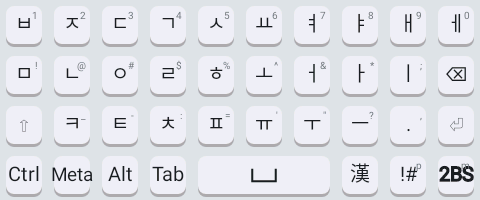

`!#` 키는 특수문자 자판을 연다. 모든 키가 해당 기호를 입력한다. 키를 길게 누르면 대체 문자가 곧바로
입력된다 — 겨냥할 팝업도, 끌고 갈 곳도 없다. 마침표를 길게 누르면 쉼표가, `_`를 길게 누르면 `-`가
입력된다. 물리 키보드가 한 키에 묶어 두는 짝 그대로다:

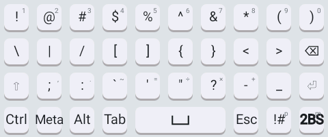

`pad` 키는 특수키 자판을 연다. 오른쪽 키패드와 특수키로 구성된다. 숫자와 `+ - = .`는 텍스트를 입력하고,
`Esc`·`PrtSc`·`ScrLk`·`Pause`·`Menu`는 키 이벤트를 보낸다. `Num`을 누르면 키패드가 화살표·이동키로
바뀌며, 이때 오른쪽 맨 위 키는 앞으로 지우기(Del)가 된다:

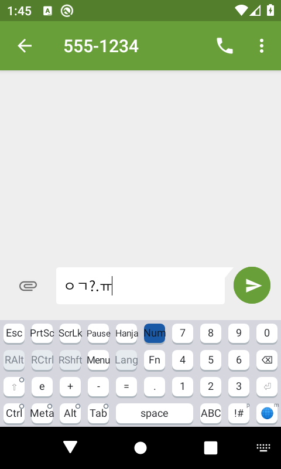

`Fn`은 페이지 전체를 기능키·미디어키로 바꾼다. F1–F12는 키 이벤트를 보내고, 안드로이드 키코드가 없는
F13–F15와 미디어키·뒤로가기는 비활성 상태로 둔다:

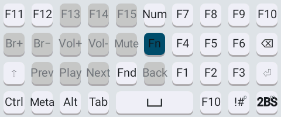

`☰` 키는 메뉴 페이지를 연다. 오른쪽 절반이 편집하는 손이다 — 안쪽 끝에 복사·잘라내기·붙여넣기,
가운데에 전체선택을 두고 화살표가 십자로, 그 둘레에 Home/End/PgUp/PgDn/Ins/Del, 그리고 오른쪽 아래
구석에 설정. 왼쪽 절반에는 실행취소·다시실행, 날짜 입력, 키보드 높이, 플로팅 전환, 시스템 키보드 설정
바로가기가 있다.

> 위 네 이미지는 실제 자판 데이터로 렌더한 것이라 각 페이지를 통째로 보여 준다. 실제로 돌아가는
> 모습은 아래에 있다.

## 플로팅 키보드

☰ 메뉴의 **Floating** 타일을 누르면 키보드가 화면 아래에 붙는 대신 앱 위에 뜨는 반투명 패널이 된다.
태블릿 가로 모드에서 화면 전체 폭 키보드는 치기에도 넓고 가리기에도 크다는 문제에 대한 답이다.

패널은 화면의 한쪽 절반 안에만 있을 수 있고 그 절반보다 넓어질 수 없다. 나머지 절반은 그대로 쓴다.
제목 줄은 왼쪽부터 이렇다.

| 키 | 하는 일 |
|---|---|
| ☰ | 끌어서 패널을 옮긴다. 자기 절반 안에서는 자유롭게. |
| ‹ / › | 반대편 절반으로, 중앙선을 기준으로 거울처럼 옮긴다. |
| ✕ | 플로팅 모드를 끝내고 원래 키보드로 돌아간다. |
| ⇲ | 끌어서 패널 크기를 바꾼다. |

드래그는 중앙선에서 멈춘다. 반대편으로 넘어가는 것은 화살표 키의 몫이고, 넘어갈 때는 새 자리에
떨어지는 것이 아니라 반사된다 — 왼쪽 가장자리에 붙어 있던 패널은 오른쪽 가장자리에 붙어 나타난다.
패널 바깥은 전부 앱의 것이다. 키보드는 그곳의 터치를 가져가지 않고, 앱이 키보드 자리를 내주려고
줄어들지도 않는다. 모드와 패널 위치는 저장되며, 화면을 돌리면 패널이 사라지는 대신 비율로 옮겨진다. 얼마나 진하게
보일지는 설정의 투명도 슬라이더로 정한다 — 거의 안 보이는 수준부터 완전 불투명까지.

## 한자 변환

한자 키 — 특수키 자판의 키, 또는 사용자가 지정한 물리 키 — 를 누르면 한글이 한자로 변환된다.

- **선택 영역**이 있으면 선택 전체를 변환한다.
- 선택이 없으면 **커서 바로 앞의 읽기**를 변환하되 최장 일치를 우선하므로, `학교`는 `교`만이 아니라
  `學校`로 변환된다.
- **한자** 위에서 누르면 독음으로 되돌린다. 한자 단어도 단어 독음으로 변환된다.

후보는 별도의 창에 키보드 가로 폭 전체를 써서 아홉 개씩 격자로 표시된다. 훈음은 한자 아래가 아니라
오른쪽에 붙고(家 집 가), 칸이 좁으면 두 줄로 접힌다. 이 창은 키보드의 일부가 아니므로 화면 키보드,
화면에 키보드가 아예 없는 외장 키보드, 플로팅 패널 어디서나 똑같이 뜨며, 떠 있는 동안 크기를 유지하므로
마지막 짧은 페이지에서 창이 흔들리지 않는다. 후보를 탭하거나 숫자키 **1**–**9**로
고를 수 있고, `←`/`→`와 `PageUp`/`PageDown`으로 페이지를 넘기며 `Esc`로 닫는다.

사전은 앱에 포함되어 있으며 메모리로 올리지 않고 있는 자리에서 찾는다. 정렬된 파일을 APK에서 그대로
메모리 매핑해 조회마다 이진 탐색하므로 자바 힙을 쓰지 않고, 메모리가 부족하면 커널이 해당 페이지를
버릴 수 있다. 같은 데이터를 해시맵으로 풀면 약 2.6 MB의 힙을 썼다. 출처와 라이선스는
[THIRD_PARTY_NOTICES.md](THIRD_PARTY_NOTICES.md) 참고.

## 물리 키보드

블루투스나 유선 키보드에서는 한글 모드일 때 글자 키가 2벌식 자모로 매핑된다. 설정에서 **기능마다 여러
개의 물리 키**를 지정할 수 있다.

- **한/영 전환** — 예: `Shift+Space`와 `오른쪽 Ctrl`을 함께.
- **한자** — 예: `F9`와 `오른쪽 Alt`를 함께.

바인딩은 단일 키일 수도, 수정자 조합일 수도 있다. 수정자만 눌렀다 떼면 그 키 자체로 등록된다. IME가
가져가지 않는 수정자 조합은 앱으로 통과시키므로 애플리케이션 단축키가 그대로 동작하고, 소프트 `Ctrl` +
글자는 실제 조합키를 보내므로 터미널은 제어 코드를, 편집기는 전체선택·복사·붙여넣기·실행취소를 받는다.

## 설정

설정 화면은 기본 컨트롤만 사용하며 시스템 테마를 따른다.

- **어느 화면의 설정인지** — 높이·자판 선택과 순서·플로팅 키보드는 **세로와 가로가 따로 저장된다.**
  맨 위에서 지금 설정하는 쪽을 고른다(기기를 돌리지 않고도 반대쪽을 손볼 수 있다).
- **키보드 높이** — 1부터 50까지. 25가 기본 크기이고 50이 그 두 배다. 화면에서 차지하는 비율도 함께 보인다.
- **플로팅 키보드** — 이 화면에서 쓸지 여부와 불투명도 1–100%.
- **키 입력 피드백** — 시각·진동·소리 강도를 각각 0–100%로(기본값 30·10·10).
- **키 자동 반복** — 사용 여부, 시작 지연, 반복 간격.
- **물리 키보드 단축키** — 한/영·한자 키 등록 및 삭제.

화면 위쪽의 **뒤로 가기** 버튼으로 언제든 메인 화면으로 돌아갈 수 있다.

## 테마

키보드는 색을 하드코딩하지 않고 기기 테마에서 해석한다.

- 시스템 라이트/다크 모드를 존중한다(`Configuration.UI_MODE_NIGHT_MASK`).
- 색조를 임의로 고르지 않고 Material 역할로 배정한다 — 배경은 surface, 키는 올라온 surface, 라벨은
  on-surface, 활성 키는 primary, 눌림 효과는 primary 스테이트 레이어.
- Android 12+에서는 사용자의 **Material You** 팔레트를 사용해 사용자 테마에 맞추고, 구버전에서는
  다듬어 둔 라이트/다크 팔레트로 폴백한다.

키, 롱프레스 팝업, 한자 후보 창, 플로팅 패널이 모두 하나의 팔레트를 공유한다.

## 구조

안드로이드 표준 진입점인 `InputMethodService`를 사용한다. 입력 코어는 의도적으로 안드로이드 비의존으로
두어 JVM에서 단위 테스트할 수 있다. 이벤트 정규화, 의미 자모, 2벌식 하드웨어 매핑, 디스패치 판정, 불변
전이 계획, 검증된 에디터 실행, 유니코드 안전 삭제, 한자 테이블, 자동반복·단축키 설정이 여기에 속한다.

커서 상태는 AOSP LatinIME 모델을 따른다. 에디터의 `onUpdateSelection`이 언제나 덮어쓰는 수동적 캐시이며,
미상(`-1`) 선택영역을 허용한다. 커서에 대한 내부 판단이 에디터와 어긋난다는 이유로 입력을 거부하는 일은
없다.

키보드는 캔버스로 그린다. 눌리지 않은 키보드를 비트맵에 한 번 렌더해 두고 레이아웃·강조 상태·크기·테마가
바뀔 때만 다시 만든다. 키를 누르면 그 키 하나에만 색을 입히므로 입체 스타일의 프레임당 비용이 없다. 이
캐시는 `RGB_565` 다 — 키보드는 불투명하므로 알파 채널이 필요 없고, 픽셀당 절반은 태블릿에서 크다.

- Java / JDK 17 LTS
- Android SDK 36 (`targetSdk 36`, `minSdk` 은 modern 28 / legacy 21)
- Android Gradle Plugin 9.2.1, Gradle 래퍼 9.4.1
- R8 최소화, 서드파티 런타임 라이브러리 없음

## 빌드

로컬 빌드에는 JDK 17과 Android SDK 플랫폼 36, 빌드 툴 36.0.0이 필요하다. 시스템 Gradle 대신 저장소에
포함된 래퍼를 사용한다.

```sh
./gradlew testModernDebugUnitTest assembleModernDebug   # 안드로이드 9 이상
./gradlew assembleLegacyDebug                            # 안드로이드 4.0 이상
```

서명된 릴리즈 빌드에는 로컬 `keystore.properties`가 추가로 필요하다. 없으면 릴리즈 변형이 서명되지 않을
뿐이다.

## 문서

### 안드로이드 IME 구현 매뉴얼

[English](docs/android-ime-manual.md) · **[한국어](docs/android-ime-manual.ko.md)**

안드로이드 입력기를 만들기 위한 매뉴얼이다. IME가 어떤 구조인지, 그대로 베껴 쓸 수 있는 최소 동작
예제, 읽어 볼 가치가 있는 레퍼런스 구현, 그리고 어려운 부분들을 각각 이 프로젝트에서 그것을 빚어낸
실패와 함께 다룬다.

다루는 내용:

- **IME의 구조** — 서비스, `method.xml`, 입력 뷰와 후보 뷰, 시스템이 IME를 찾고 활성화·선택하는 과정,
  터치에서 에디터까지의 데이터 흐름;
- **최소 동작 IME** — 붙여넣어 바로 돌릴 수 있는 매니페스트·`method.xml`·서비스와, 이후 키워 나가는 순서;
- **레퍼런스 구현과 받는 곳** — AOSP LatinIME와 `SoftKeyboard` 예제, clone 명령과 각각에서 읽을 부분;
- `InputMethodService` 생명주기와 **실측한 teardown 순서** — 문서가 암시하는 깔끔한 순서가 아니다;
- `InputConnection` 계약, 그리고 삽입과 상대 삭제가 커서 위치를 알 필요가 없는 이유;
- **에디터가 권위자다** — 여기서 따라 나오는 수동적 커서 캐시와, 키보드가 자기 장부 때문에 입력을
  거부해선 안 되는 이유;
- 에디터 종류: 터미널(`TYPE_NULL`, 선택영역 `-1`)과 거기서 깨지는 것들;
- 조합 중인 글자, 물리 키보드와 수정자 조합, 후보 뷰;
- 커스텀 키보드를 싸게 그리는 법, 시스템·Material You 팔레트에 맞추는 법, 그리고 실행 중인 키보드에
  설정을 즉시 반영하는 법;
- 헤드리스 에뮬레이터가 IME에 대해 증명할 수 있는 것과 없는 것;
- **상세한 안티패턴 장** — 이 프로젝트의 실제 실패 10건을 "만든 것 / 벌어진 일 / 해결 / 규칙" 형식과
  틀린 예 → 옳은 예 코드로 정리;
- 릴리즈 전 점검표.

영어판이 기준이고 한국어판은 그 번역본이며, 두 문서는 서로 링크되어 있다. 그리고 ReteKey의 IME 구현이
바뀔 때마다 갱신되는 **살아 있는 문서**라서, 의도가 아니라 실제로 동작하는 코드를 설명한다.

설계 RFC, 검증 카탈로그, 결정 기록, 변경 이력은 비공개 동반 저장소에 있으며 이 공개 저장소에 포함되지
않는다.

## 라이선스

MIT — [LICENSE](LICENSE) 참고. 포함된 서드파티 데이터와 이식한 코드의 출처는
[THIRD_PARTY_NOTICES.md](THIRD_PARTY_NOTICES.md)에 밝혀 두었다.
