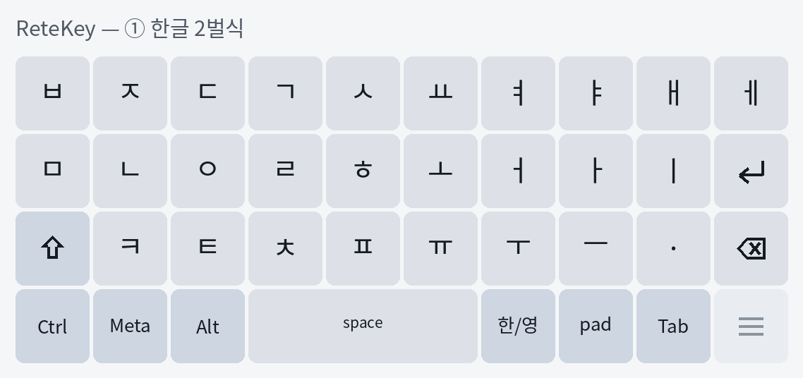
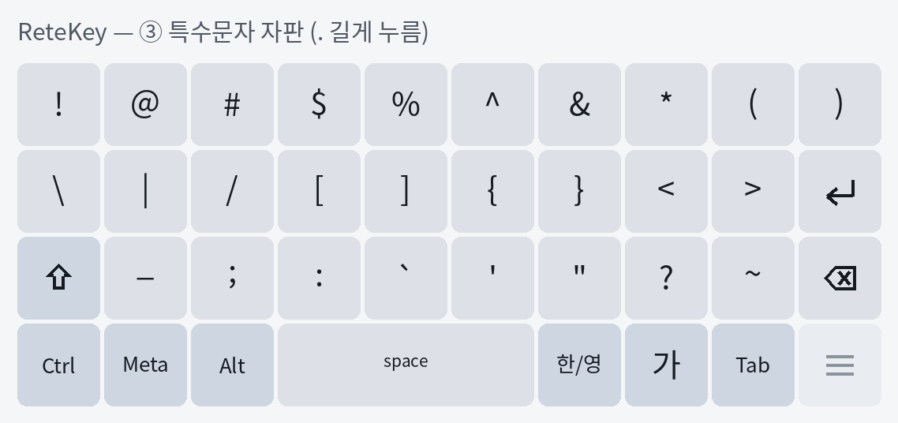
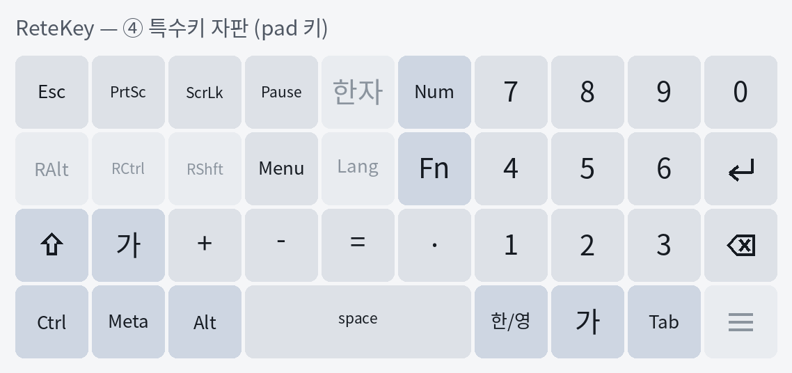
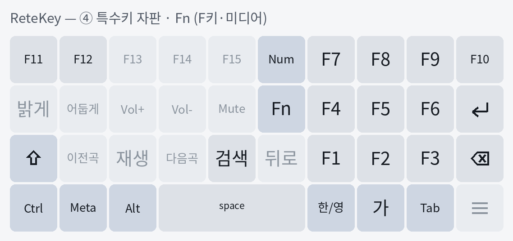

# ReteKey IME

MIT-licensed Android Hangul keyboard focused on standard IME behavior, hardware-key friendliness, and efficient Korean input.

## Download

**[⬇ Download the latest APK](https://github.com/rubidus-api/retekey_apk/releases/latest/download/retekey.apk)** &nbsp;·&nbsp; [all releases](https://github.com/rubidus-api/retekey_apk/releases)

Current release: **v0.1.19** — [retekey-0.1.19.apk](https://github.com/rubidus-api/retekey_apk/releases/download/v0.1.19/retekey-0.1.19.apk)

## Status

P1A source-neutral input and P1B checked editor/session reliability are complete.
T012-core is verified on a real Android lane (API 33 emulator): start, view,
restart without finish, and teardown behave as specified against the actual
framework callback stream. The stateful Hangul composer (P2) is next; the full
API matrix and the Galaxy Note20 gate remain open.

The touch layout is one orthogonal ten-column grid with equal keys, a
three-column space bar, and no staggered rows. It has four pages: English
QWERTY, Korean 2-beolsik, special characters, and special keys.

## Layout

Korean 2-beolsik:



Holding the period opens the special-characters page. Every key commits text:



The `pad` key opens the special-keys page: a right-hand keypad plus special keys.
The digits and `+ - = .` commit text; Esc, PrtSc, ScrLk, Pause, and Menu send key
events; the 한자 key converts the reading before the cursor to Hanja (candidate strip
with 훈음 glosses and paging; 한글↔한자 both ways); Lang and the right-hand modifiers
are muted until their systems land.
`Num` turns the keypad into arrows/navigation:



`Fn` swaps the whole page to the function and media keys. F1-F12 send key events;
F13-F15 (no Android keycode), the media keys, and Back stay muted:



Drag two fingers up or down on the keyboard to resize its height; the setting is
remembered. Each key's label scales to fit its cell, so it stays readable at any
height.

> These images are rendered from the actual layout data. A live screenshot from
> the emulator lane is not shown because that host is headless with no KVM and no
> window, so `screencap` returns a blank framebuffer; capture on a real device or
> a GUI emulator for device screenshots. `PreviewActivity` (the app's launcher
> screen) provides a text field for trying the keyboard on such a device.

## Stack

- Java/JDK 17 LTS
- Android SDK 36 (`minSdk 29`, `targetSdk 36`)
- Android Gradle Plugin 9.2.1
- Gradle Wrapper 9.4.1

The app uses Android's standard `InputMethodService` entry point. Event
normalization, semantic jamo, 2-beolsik hardware mapping, dispatch disposition,
matched key-up tracking, immutable transition plans, checked editor execution,
Unicode-safe deletion, and bounded selection reconciliation are plain Java and
JVM-tested. The current stateless compatibility-jamo fallback keeps scaffold
input visible; the stateful Hangul composer remains planned.

## Documentation

Design RFCs, the verification catalog, decisions, and the changelog are kept in a
private companion repository and are not part of this public surface.


## Build

Local builds require JDK 17 and Android SDK platform 36/Build Tools 36.0.0.
Use the checked-in wrapper rather than a system Gradle:

```sh
./gradlew testDebugUnitTest assembleDebug
```

Compile the Android lifecycle harness without changing device state:

```sh
./gradlew :testhost:assembleDebug :app:assembleInstrumentationAndroidTest
```

Run it only on an authorized, unlocked test device. The runner preserves and
restores the previously selected/enabled IME state and never prints its id.
The host also needs `adb`, `sha256sum`, `base64`, and util-linux `flock`:

```sh
scripts/run-ime-instrumentation.sh connected
scripts/run-ime-instrumentation.sh matrix
```

On a host with no device and no KVM, the emulator lane boots its own guest under
plain TCG emulation and runs the same case on it:

```sh
scripts/emulator-lane.sh run
```

See `docs/manual/emulator-lane.md` for why it pins an API 33 AOSP ATD x86_64
image and what the lane does and does not prove.

The private matrix file is declarative, not a shell script: use exactly one
plain `KEY=value` line for each key named by `--help`; blank lines and full-line
`#` comments are allowed. Unknown, duplicate, executable, or malformed content
is rejected without printing its values.

The workspace build target is arch-dev through ignored private configuration:

```sh
scripts/build-arch-dev.sh --check-config
scripts/setup-arch-dev-android-sdk.sh install
scripts/sync-arch-dev.sh sync
scripts/build-arch-dev.sh build
```

Do not put private remote hosts, paths, ports, user names, key names, or credentials in tracked files.
