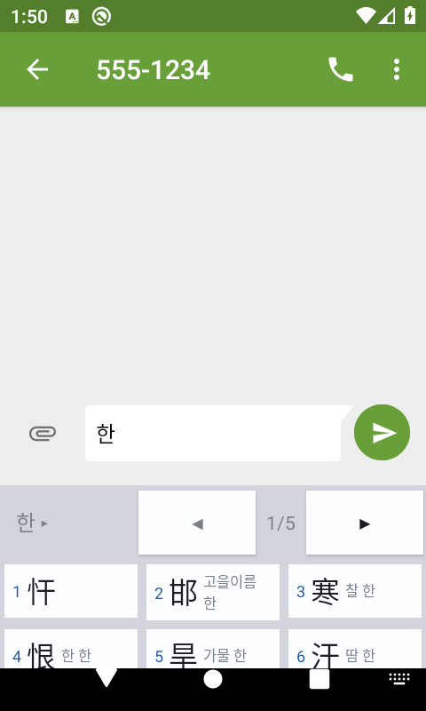

# ReteKey IME

**English** · [한국어](README.ko.md)

An MIT-licensed Android Hangul keyboard focused on standard IME behaviour, hardware-keyboard
friendliness, and efficient Korean input. Written in plain Java with no third-party runtime
dependencies — the release APK is about 460 KB, most of it the Hanja tables.

> This English README is the canonical version. The Korean translation follows it.

## Table of contents

- [Download](#download)
- [Android version support](#android-version-support)
- [Features](#features)
- [Layout](#layout)
- [Floating keyboard](#floating-keyboard)
- [Hanja conversion](#hanja-conversion)
- [Physical keyboards](#physical-keyboards)
- [Settings](#settings)
- [Theming](#theming)
- [Architecture](#architecture)
- [Build](#build)
- [Documentation](#documentation)
- [License](#license)

## Download

**[⬇ Android 9+](https://github.com/rubidus-api/retekey_apk/releases/latest/download/retekey.apk)**
&nbsp;·&nbsp;
**[⬇ Android 4.0+](https://github.com/rubidus-api/retekey_apk/releases/latest/download/retekey-legacy.apk)**
&nbsp;·&nbsp; [all releases](https://github.com/rubidus-api/retekey_apk/releases)

Current release: **v0.1.77** —
[retekey-0.1.77.apk](https://github.com/rubidus-api/retekey_apk/releases/download/v0.1.77/retekey-0.1.77.apk)

After installing, enable ReteKey in *Settings → Keyboards* and select it as the default input
method. The app's launcher screen has shortcuts for both steps and a field for trying the keyboard.

## Android version support

There are two builds of the same app. Install whichever your device takes; they carry the same
package name, so one replaces the other.

| Build | Runs on | APK |
|---|---|---|
| **modern** | Android 9 – 16 (API 28–36) | `retekey.apk` |
| **legacy** | Android 4.0 – 16 (API 14–36) | `retekey-legacy.apk` |

Both are built from the same source, target API 36, and behave identically wherever the platform
lets them. The split exists because reaching down to Android 4 means taking an older road in a few
places, and there is no reason to make a current phone take it.

### What the legacy build does differently

Three things, all of them on the device's side of a version check rather than in a separate
codebase:

| On older Android | What happens | From |
|---|---|---|
| Vibration | one fixed strength instead of a strength dial — `VibrationEffect` is API 26, and the older call only takes a duration | below API 26 |
| Sliders | the keyboard-height and opacity sliders run from zero internally and are offset — `SeekBar.setMin` is API 26 | below API 26 |
| Deletion | code-point deletion is not available, so the UTF-16 fallback already used for older editors handles it; a syllable or emoji still disappears in one press | below API 24 |
| Shadows | the Hanja window has no drop shadow — `PopupWindow.setElevation` is API 21 | below API 21 |
| Theme | the screens use the platform's own DeviceDefault rather than Material | below API 21 |

Everything else — the five layouts, the 2-beolsik and 12-key composers, Hanja conversion, the
floating keyboard, physical keyboards, auto-repeat, theming — is the same code on both. The app
uses no `java.time`, no `java.util.function`, and no library desugaring, which is why the legacy
APK is *smaller* than the modern one rather than larger.

Android 4.0 is where it stops, and the reason is structural rather than stubborn. Below API 11
there is no `InputMethodSubtype` (so no 한/영 mode), no `KeyEvent.isCtrlPressed` or F-key codes (so
no physical-keyboard support), no `Insets.touchableRegion` (so no floating keyboard); below API 9
there is no `getSelectedText` (so no Hanja on a selection) and no `MotionEvent.getActionMasked`.
Reaching Android 2 would not be a port of this keyboard; it would be a different, much smaller
one.

Android 12 (API 31) and newer still take the Material You palette on both builds; below it, both
fall back to the tuned light/dark palette.

### On a device

Screencaps from emulators running the release builds — the modern one on Android 10, the legacy one
on Android 4.4.

| | |
|---|---|
|  |  |
| 2-beolsik: raised keys, each with its hold alternate in the corner | the Hanja window: keyboard-wide, 훈음 beside each character, nine to a page |
|  |  |
| the ☰ page: editing and cursor keys on the right, settings in the corner | the floating keyboard, translucent and confined to its half of the screen |

### The legacy build, on Android 4.4

These are screencaps from a KitKat emulator running the legacy APK — not renders, and not the
modern build with an older label on it.

| | |
|---|---|
|  |  |
| 2-beolsik with its hold alternates, on a 2013 platform | the Hanja window: full keyboard width, 훈음 beside each character, six pages |
|  |  |
| the ☰ page: editing and cursor keys on the right, settings in the corner | settings, reached from that corner key |

The labels read as words rather than glyphs here, and that is the legacy build doing its job: a
screenshot of an earlier attempt showed the menu key as an *empty cell*, because Android 4.4 has no
font for ☰. Below the version where those glyphs became dependable, the keys say `Menu`, `Copy`,
`Bksp`, `Lang` instead of drawing nothing.

### What has actually been run

| | Version | How |
|---|---|---|
| Verified by an automated lane | Android 13 — API 33 | AOSP x86_64 emulator, IME lifecycle test |
| Verified by hand | Android 13 — API 33 | Galaxy Note20, the project's primary device |
| Verified by hand | Android 13 — API 33 | the legacy build, on the same emulator |
| Verified by hand | **Android 4.4 — API 19** | the legacy build on a KitKat emulator: Korean types, 한자 converts, settings opens |

The rows above are the versions an actual run has covered. The rest of each range is supported by
construction: every platform call the app makes exists at that build's floor, and the ones that do
not are behind an explicit version check. Lint agrees at both floors, with no errors.

## Features

- **Five layouts** — 2-beolsik, QWERTY, Dvorak, and the 12-key 천지인 and 나랏글 phone modes. A 🌐
  key walks the ones you enabled, in the order you set; holding it opens the menu.
- **Stateful 2-beolsik Hangul composer** with compound vowels and final consonants, consonant
  migration, and reversible backspace (닭 → 달 → 다).
- **Hanja conversion** in both directions, with 훈음 glosses, paging, and number-key selection, in
  a window of its own that appears whichever keyboard you are using.
- **Floating keyboard** for a tablet in landscape: a translucent panel confined to one half of the
  screen, draggable, resizable, and mirrored to the other half with one key.
- **Physical keyboard support**: user-assignable KO/EN and Hanja keys, modifier chords, and
  2-beolsik mapping for Bluetooth or wired keyboards.
- **Held-key auto-repeat** for space, enter, backspace and the arrows, with a configurable start
  delay and interval.
- **Raised, rounded keys** with press feedback — the pressed key tints, the gaps between the keys
  blink, and the character you just typed appears large in a box above them, plus haptics and
  sound, each independently adjustable.
- **Hold a key to type its alternate** straight away: no popup, no drag. The letter pages hold
  `1234567890` on the top row, `!@#$%^&*;` on the middle one, and `_-:='"?` on the bottom one.
- **Follows the system theme** — light/dark, and the Material You palette on Android 12+.

## Layout

The touch layout is one orthogonal ten-column grid with equal keys and no staggered rows. The
bottom row is the same on every page of the full-size layouts:
`Ctrl · Meta · Alt · Tab · space · !# · 🌐`, with space three columns wide. The menu and the keypad
page do not have keys of their own — they are opened by holding 🌐 and `!#`, which say so with a
small `m` and `p` in the corner. One cell is left over beside `!#`. Each layout puts what its own users reach for
there: 漢 for Hanja on 2-beolsik, `Esc` on QWERTY and Dvorak — a real
`KEYCODE_ESCAPE`, for vi over ssh — and nothing on the rest. The two 12-key pages keep the same frame in
a different shape: the modifiers own the leftmost column, the second one is empty, every Hangul key
is two columns wide, and the right-hand column carries backspace, space, then the period and Enter,
with `!#` and 🌐 closing the bottom row. The cell beside Tab carries 漢 on both of them, which
converts on a tap. 천지인 puts 다음 beside Alt and flanks ㅇㅁ with `.,` and `!?`, which work the way
the Hangul keys around them do: tapping moves through the characters on the face, and dragging left
or right picks the one written on that side.

Five letter layouts share that grid:

| Layout | Shape |
|---|---|
| **두벌식** | the standard Korean full keyboard |
| **QWERTY** | English |
| **Dvorak** | English, in its own 7/10/9 shape; the three cells the top row does not need for letters carry Enter, backspace and the period, on the left |
| **천지인** | 12-key: the elements ㅣ ㆍ ㅡ build the vowels and each consonant key cycles its group (ㄱ → ㅋ → ㄲ). A **drag** off a key types at once what the taps would reach. Off a consonant: left the plain letter (ㄱ), right the aspirate (ㅋ), down the tense one (ㄲ), and nothing above — the digit is held for, not dragged to. A group with no tense letter (ㄴㄹ, ㅇㅁ) has no cell below it either. Off a vowel key the direction points at the letter: from ㆍ, left ㅓ · right ㅏ · up ㅗ · down ㅜ; from ㅣ, left ㅔ · right ㅐ · up ㅒ · down ㅖ; from ㅡ, left ㅝ · right ㅘ · up ㅚ · down ㅟ. A dragged vowel goes on combining (drag ㅗ, tap ㅣ, and it is ㅚ). **Holding** a key raises a guide of those cells with the key's digit in the middle, and waits: drag to one and lift to type it, or lift without moving for the digit. The ten Hangul keys sit where a phone keypad's do and hold what it holds — `1`–`9`, and `0` under ㅇㅁ. Two taps of one key in a row are one cycle, so a pause — or the **다음** key — starts the next letter |
| **나랏글** | 12-key: a consonant block with 획 adding a stroke (ㄴ → ㄷ → ㅌ) and 쌍 doubling (ㅅ → ㅆ); a vowel key pressed twice reaches its pair (ㅏ → ㅓ, ㅗ → ㅜ) and 획 iotates it (ㅏ → ㅑ, ㅗ → ㅛ). Its twelve keys sit where a phone keypad's do, so holding one types what a phone keypad holds: `1`–`9`, `0` under ㅡ, `*` and `#` either side |

The 🌐 key walks the layouts you ticked in settings, in the order you put them there, naming each
one as it arrives. Holding it runs the Hanja conversion.

Holding a letter key types a character instead of repeating it. The alternates come in three groups
— `1234567890`, `!@#$%^&*;` and `_-:='"?` — one to a row. Their sizes are 10/9/7, which is QWERTY's
row shape and Dvorak's 7/10/9 read in a different order, so Dvorak carries the same three groups
rotated to fit: rows 1-2-3 become 3-1-2, and no group is split or padded. Space, enter, backspace
and the arrows have no alternate and keep repeating when held.

A physical keyboard is not affected by any of this: it keeps its own layout, and the on-screen
choice only changes what the on-screen keys do.

The five, as they are:

**두벌식** — 漢 beside `!#` converts what you just typed:


**QWERTY** — `Esc` beside space, for vi over ssh:


**Dvorak** — the same bottom row, its own 7/10/9 letter block:


**천지인** — 다음 beside Alt, 漢 beside Tab, and `.,` `!?` either side of ㅇㅁ:


**나랏글** — 획 and 쌍 on the bottom letter row, 漢 beside Tab:


The `!#` key opens the special-characters page, where every key commits its symbol. Holding a key
types its alternate immediately — there is no popup to aim at and nothing to drag to. Holding the
period types a comma, and holding `_` types `-`, the pair a physical keyboard puts on one key:


**Holding `!#`** opens the special-keys page: a right-hand keypad plus the special keys. It opens
with `Num` **on**, showing digits — num lock means digits here as it does on any keyboard. The
digits and `+ - = .` commit text; `Esc`, `PrtSc`, `ScrLk`, `Pause` and `Menu` send key events:


Turning `Num` **off** swaps the keypad for arrows and navigation — Home/End, PgUp/PgDn, Ins, and
forward-delete:


`Fn` swaps the whole page to the function and media keys. F1–F12 send key events; F13–F15 (which
have no Android key code), the media keys and Back stay muted:


### The menu page

**Holding 🌐** opens it. The right half is the editing hand — copy, cut and paste down its near
edge, the arrows in a cross with select-all at their centre, the jump keys around them, and
settings in the corner a thumb reaches without looking. The left half is everything about the
keyboard itself.


| | Key | Does |
|---|---|---|
| ↶ | undo | undo the last edit |
| ↷ | redo | redo it |
| 📅 | date | insert the current date and time as text |
| ☺ | emoji | *not built yet — drawn muted* |
| 🗒 | clipboard | *not built yet* |
| ⧉ | copy | copy the selection |
| ✂ | cut | cut the selection |
| 📋 | paste | paste the clipboard |
| ⬚A | select all | select everything in the field |
| size− / size+ | height | shrink or grow the keyboard, one step per press, remembered per orientation |
| ⌨↔ | switch keyboard | open the system input-method picker |
| ⌨⚙ | manage keyboards | open the system screen for enabling keyboards |
| ❐ | floating | turn the floating panel on or off |
| ◀\| / \|↔\| | one-handed | *not built yet* |
| ◐ | theme | *not built yet* |
| ★1 / ★2 | custom | *not built yet* |
| Set | settings | open ReteKey's own settings |
| ← ↑ → ↓ | arrows | move the cursor; they repeat when held |
| Home / End | line ends | jump to the start or end |
| PgUp / PgDn | page | jump a page |
| Ins | insert | the Insert key |
| Del | forward delete | delete forward |
| ABC | back | leave the page and return to the letters |

The muted keys are drawn but do nothing: they are the places the features will go, marked so the
page does not shift under you when they arrive.

## Floating keyboard

The menu page's **❐ floating** key turns the keyboard into a translucent panel that floats over the
app instead of docking to the bottom edge — the shape a tablet in landscape wants, where a
full-width keyboard is both too wide to type on and too tall to see past.

The panel is confined to one half of the screen and can never be wider than that half, so the other
half stays yours. Its title bar carries, left to right:

| Key | Does |
|---|---|
| ☰ | drag to move the panel, anywhere within its half |
| ‹ / › | send the panel to the other half, mirrored about the centre line |
| ✕ | leave floating mode and go back to the ordinary keyboard |
| ⇲ | drag to resize the panel |

Dragging stops at the centre line: crossing over is the arrow key's job, and it reflects the panel
rather than dropping it somewhere new, so a panel hugging the left edge comes back hugging the
right one. Everything outside the panel still belongs to the app — the keyboard takes no touches
there and the app is not resized to make room for it. The mode and the panel's placement are
remembered, and a rotation rescales the panel instead of stranding it off-screen. How solid the
panel is, is yours to set — the opacity slider in settings runs from barely-there to fully solid.

## Hanja conversion

Pressing the 한자 key — the one on the special-keys page, or a physical key you assigned — converts
Korean to Hanja:

- With a **selection**, the whole selection is converted.
- With **no selection**, the reading immediately before the cursor is converted, preferring the
  longest match, so `학교` becomes `學校` rather than converting `교` alone.
- Pressing it on **Hanja** converts back to its reading, including whole Hanja words.

Candidates appear in a window of their own, spanning the keyboard's full width, in a paged grid of
nine. Each 훈음 gloss sits beside its character (家 집 가) and wraps onto a second line when the
column is narrow. The window is not part of the keyboard, so it appears the same way for the
on-screen keyboard, an external keyboard with no keyboard on screen at all, and the floating panel;
it keeps one size while it is up, so a short last page does not resize it. Tap a candidate, or
press its number key **1**–**9**; `‹`/`›` in the header — or `←`/`→` and `PageUp`/`PageDown` on a
keyboard — turn the page, and **✕** leaves without converting, as `Esc` does. What you typed stays
as you typed it: it is a way out, not an undo.


> **Known limitation.** On a device with an on-screen navigation bar the panel's last row can end up
> over it. The candidates are visible and the number keys still pick them, but that row may not take
> a tap. The panel is a child of the keyboard's window and used to be clipped to it — losing the row
> entirely — which is fixed; placing it clear of the system bars is not.

The dictionary is bundled and searched where it lies: the tables are sorted files, memory-mapped
out of the APK and bisected per lookup, so they cost the Java heap nothing and the kernel is free to
drop their pages under memory pressure. Parsing the same data into hash maps used to cost about
2.6 MB of heap. See [THIRD_PARTY_NOTICES.md](THIRD_PARTY_NOTICES.md) for provenance and licences.

## Physical keyboards

With a Bluetooth or wired keyboard, letter keys are mapped to 2-beolsik jamo while Korean mode is
on. In settings you can assign **several physical keys per function**:

- **KO/EN toggle** — for example `Shift+Space` *and* `Right Ctrl`.
- **Hanja** — for example `F9` *and* `Right Alt`.

A binding may be a lone key or a modifier chord; a modifier pressed on its own registers as itself.
Modifier chords the IME does not claim are passed through, so application shortcuts keep working,
and a soft `Ctrl` plus a letter sends a real chord — terminals receive the control code, editors
run select-all/copy/paste/undo.

## Settings

The settings screen uses stock controls only and follows the system theme:

- **Which screen these settings are for** — height, the layouts and their order, and the floating keyboard are **remembered separately for portrait and landscape.** Pick which one you are setting at the top of the screen, without having to turn the device to reach it.
- **Keyboard height**, from 1 to 50: 25 is the size it has always been and 50 is twice that. The percentage of the screen it takes is shown alongside.
- **Floating keyboard** — whether to use it on this screen, and how solid it is (1–100%).
- **Key-press feedback** — visual, vibration, and sound strengths, each 0–100% (30, 10 and 10 by default).
- **Key auto-repeat** — on/off, start delay, and repeat interval.
- **Physical keyboard shortcuts** — register and remove KO/EN and Hanja keys.

A **Back to main screen** button at the top returns to the app's main screen at any time.

## Theming

The keyboard resolves its colours from the device theme rather than hardcoding them:

- The system light/dark mode is honoured (`Configuration.UI_MODE_NIGHT_MASK`).
- Colours are assigned by Material role — background as surface, keys as an elevated surface,
  labels as on-surface, active keys as primary, and the press effect as a primary state layer.
- On Android 12+ the user's **Material You** palette is used, so the keyboard matches their theme;
  older versions fall back to a tuned light/dark palette.

The keys, the long-press popup, the Hanja candidate window, and the floating panel all share
one palette.

## Architecture

The app uses Android's standard `InputMethodService` entry point. The input core is deliberately
Android-free so it can be unit-tested on the JVM: event normalisation, semantic jamo, the 2-beolsik
hardware mapping, dispatch disposition, immutable transition plans, checked editor execution,
Unicode-safe deletion, the Hanja tables, and the key-repeat and shortcut settings.

Cursor state follows the AOSP LatinIME model: a passive cache that the editor's own
`onUpdateSelection` always overrides, tolerating unknown (`-1`) selections. The keyboard never
refuses input because its idea of the cursor disagrees with the editor's.

The keyboard is drawn on a canvas. The unpressed keyboard is rendered once into a cached bitmap and
reused until the layout, highlight state, size, or theme changes; a key press only tints one key, so
the raised styling costs nothing per frame. That cache is `RGB_565` — the keyboard is opaque, so it
needs no alpha channel, and half the bytes per pixel matters on a tablet.

- Java / JDK 17 LTS
- Android SDK 36 (`targetSdk 36`; `minSdk 28` modern, `minSdk 21` legacy)
- Android Gradle Plugin 9.2.1, Gradle wrapper 9.4.1
- R8 minification; no third-party runtime libraries

## Build

Local builds require JDK 17 and Android SDK platform 36 with Build Tools 36.0.0. Use the checked-in
wrapper rather than a system Gradle:

```sh
./gradlew testModernDebugUnitTest assembleModernDebug   # Android 9+
./gradlew assembleLegacyDebug                            # Android 4.0+
```

A signed release build additionally needs a local `keystore.properties`; without it the release
variant is simply unsigned.

## Documentation

### Android IME implementation manual

**[English](docs/android-ime-manual.md)** · [한국어](docs/android-ime-manual.ko.md)

A manual for building an Android input method: how an IME is put together, a minimal working one
you can copy, the reference implementations worth reading, and then the parts that are hard — each
with the failure from this project that shaped it.

It covers:

- **how an IME is structured** — the service, `method.xml`, input and candidates views, how the
  system finds/enables/selects it, and the data flow from a touch to the editor;
- **a minimal working IME** — manifest, `method.xml`, and a service you can paste and run, plus the
  order in which to grow it;
- **reference implementations and where to get them** — AOSP LatinIME and the `SoftKeyboard`
  sample, with clone commands and what to read in each;
- the `InputMethodService` lifecycle, including the **real measured teardown order**, which is not
  the tidy one the documentation implies;
- the `InputConnection` contract, and why insertion and relative deletion never need to know the
  cursor position;
- **the editor is authoritative** — the passive cursor cache that follows from it, and why a
  keyboard must never refuse input over its own bookkeeping;
- editor kinds: terminals (`TYPE_NULL`, selection `-1`) and everything that breaks in them;
- composing text, hardware keyboards and modifier chords, and the candidates view;
- drawing a custom keyboard cheaply, theming it to the system and Material You palettes, and
  keeping settings live on a running keyboard;
- what a headless emulator can and cannot prove about an IME;
- **a detailed anti-pattern chapter** — ten real failures from this project, each with what was
  built, what went wrong, the fix, and the resulting rule, with wrong-versus-right code;
- a pre-release checklist.

The English version is canonical and the Korean version is its translation; the two link to each
other. It is a **living document**, updated whenever ReteKey's IME implementation changes, so it
describes working code rather than intentions.

Design RFCs, the verification catalog, decisions, and the changelog live in a private companion
repository and are not part of this public surface.

## License

MIT — see [LICENSE](LICENSE). Bundled third-party data and ported code are credited in
[THIRD_PARTY_NOTICES.md](THIRD_PARTY_NOTICES.md).
