# ReteKey IME

**English** · [한국어](README.ko.md)

**An Android Hangul keyboard for developers and power users** — for anyone who needs Esc, Tab, Ctrl
chords, function and arrow keys on a phone, and a keyboard that behaves itself in a terminal.

It is small and asks for almost nothing. The release APK is about 470 KB, most of that the Hanja
tables; it is plain Java with no third-party runtime dependencies, and the Hanja tables are read
straight out of the APK rather than loaded into memory. It declares **one permission, `VIBRATE`** —
an ordinary permission that is never requested at runtime and does nothing but the buzz under your
finger, which you can turn down to zero. No network, no account, no analytics.

And nothing is missing for it: Cheonjiin(천지인), Naratgeul(나랏글) and 2beolsik(2벌식), Hanja conversion, physical keyboards,
and the special keys most keyboards leave out.

> This English README is the canonical version; the Korean one is its translation.

## Table of contents

- [Download](#download)
- [What it looks like](#what-it-looks-like)
- [Who it is for](#who-it-is-for)
- [Features](#features)
- [Layout](#layout)
- [Floating keyboard](#floating-keyboard)
- [Notepad](#notepad)
- [Hanja conversion](#hanja-conversion)
- [Physical keyboards](#physical-keyboards)
- [Settings](#settings)
- [Theming](#theming)
- [Android version support](#android-version-support)
- [For developers](#for-developers)
- [The name](#the-name)
- [License](#license)

## Download

**ReteKey is on F-Droid.** If you have the F-Droid client, that is the easiest way to get it and to
keep it updated:

[](https://f-droid.org/packages/com.retekey/)

F-Droid builds the app from this source on its own servers and checks the result against the APK
published here before shipping it, so what you install is what this repository builds.

Or take an APK directly:

**[⬇ Android 9+](https://github.com/rubidus-api/retekey_apk/releases/latest/download/retekey.apk)**
&nbsp;·&nbsp;
**[⬇ Android 4.0+](https://github.com/rubidus-api/retekey_apk/releases/latest/download/retekey-legacy.apk)**
&nbsp;·&nbsp; [all releases](https://github.com/rubidus-api/retekey_apk/releases)

Current release: **v0.1.125** —
[retekey-0.1.125.apk](https://github.com/rubidus-api/retekey_apk/releases/download/v0.1.125/retekey-0.1.125.apk)

Take the first link unless your phone is older than Android 9; the two are the same app and one
replaces the other. [More about the two builds](#android-version-support). F-Droid carries the
Android 9+ build; the Android 4.0 one lives on the releases page.

### Setting it up, step by step

1. **Install it.** Open the downloaded APK on the phone and confirm. Older Android versions may
   first ask you to allow installs from unknown sources.
2. **Turn the keyboard on.** Android hides new keyboards until you enable them: *Settings →
   System → Languages & input → On-screen keyboard → Manage keyboards*, and switch ReteKey on.
3. **Choose it.** Tap any text field and pick ReteKey from the keyboard chooser, or use *Settings →
   Default keyboard*.
4. **Try it.** ReteKey's own launcher screen has a button for each of those two steps and a text
   box to type in, so you can do the whole thing without hunting through system settings.

To move between Korean, English and the 12-key layouts afterwards, tap the layout key at the bottom right. It is captioned with where it goes rather than where
you are — `>qw`, `>dv`, `>2b`, `>cj`, `>ng`, `>arw`, `>num` — so you can see what the next press will give you.
Hold it for the menu page. Which layouts that key walks through, and in what order, is yours to set
in the settings.

## What it looks like

The keyboards below are drawn by the keyboard's own rendering code, at the size a 480-pixel-wide
screen gives it — the same pixels the app puts on a phone. The floating panels are drawn over a
page of writing, because a panel you can see through has nothing to show against a blank ground.


2-beolsik: raised keys, each with its hold alternate in the corner, a bar for the space key, and
the layout key naming where it goes next.

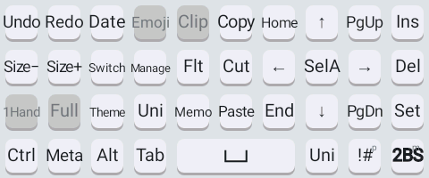

The ☰ page: editing and cursor keys on the right, the keyboard's own controls on the left, and
settings in the corner a thumb reaches without looking.

| | |
|---|---|
| 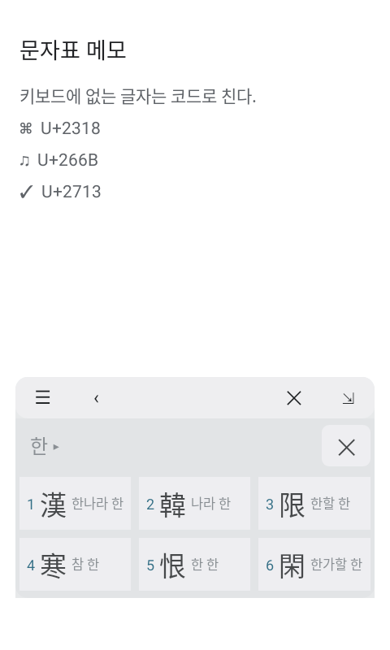 | 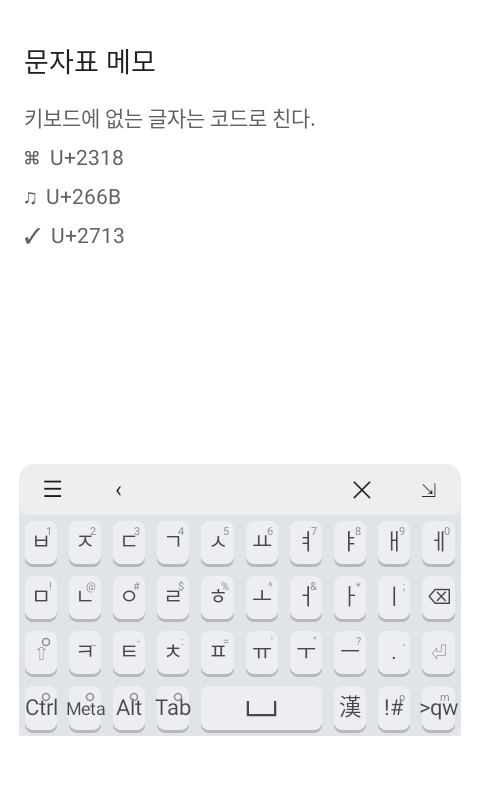 |
| the Hanja window: keyboard-wide, 훈음 beside each character, nine to a page | the floating keyboard, translucent and confined to its half of the screen |

Every layout, page and panel is shown in [Layout](#layout) below, and the older-Android build has
[screenshots of its own](#the-legacy-build-on-android-44).

## Who it is for

Most keyboards assume you are writing messages. This one assumes you are also, sometimes, working:
editing a config file over ssh, running a command in Termux, moving through a long document with
the arrow keys, or pasting into a terminal that does not behave like a chat box.

So the keys that usually go missing are here — **Esc, Tab, Ctrl, Alt, Meta, F1–F12, arrows,
Home/End, PgUp/PgDn, Ins, forward-delete, PrtSc (`Prt`)** — sending real key events rather than typing
characters that look like them. Modifier chords the keyboard has no use for are handed to the app,
so an editor's own shortcuts keep working, and a soft `Ctrl` plus a letter sends a genuine control
code to a terminal.

None of that gets in the way of ordinary typing. Korean composes properly on all three Korean
layouts, including every compound final (많, 삶, 앉), Hanja conversion works both ways, and if you
never open the keypad page you will never see the parts you do not need.

## Features

- **Twenty layouts** — 2beolsik(2벌식), QWERTY, Dvorak, Colemak, Spanish, Portuguese, Italian,
  Polish, Vietnamese (Telex), German, Turkish, French AZERTY, Greek, Hebrew, Japanese Romaji and
  the 12-key Japanese Flick, the 12-key Cheonjiin(천지인) and Naratgeul(나랏글) phone modes, and Arrows and Keypad on the same 12-key frame. The
  layout key walks the ones you enabled, in the order you set; holding it opens the menu.
- **Numbers get a keypad** — a field that takes a phone number, an amount, a PIN or a date opens
  on the 12-key Keypad. The layout key walks your own list from there, and the next ordinary field
  is back on the layout you were using.
- **An action bar**, if you want one — a strip above the keys for selecting a word, select all,
  cut/copy/paste and the arrows, in the order you choose. Off until you turn it on.
- **Out of the system's way** — the hide-keyboard and switch-keyboard buttons many ROMs draw at the
  bottom of the screen keep their band, so no key of ours is stranded underneath them. Only what is genuinely over the
  keyboard is reserved — the keyboard measures its own bottom edge against the bar rather than
  trusting the insets, since two phones can report the same bar and place the keyboard differently.
  Settings can force it either way, and shows what your phone reports and what it measured.
- **Stateful 2-beolsik Hangul composer** with compound vowels and final consonants, consonant
  migration, and reversible backspace (닭 → 달 → 다).
- **Hanja conversion** in both directions, with 훈음 glosses, paging, and number-key selection, in
  a window of its own that appears whichever keyboard you are using.
- **Notepad** on a key: a translucent full-screen panel above the keyboard, with a list that sorts
  and selects like a file manager and notes stamped the moment they are made.
- **Floating keyboard** for a tablet in landscape: a translucent panel confined to one half of the
  screen, draggable, resizable, and mirrored to the other half with one key.
- **Physical keyboard support**: user-assignable KO/EN and Hanja keys, modifier chords, and
  2-beolsik mapping for Bluetooth or wired keyboards.
- **Held-key auto-repeat** for space, enter, backspace and the arrows, with a configurable start
  delay and interval.
- **Raised, rounded keys** with press feedback — the pressed key tints, the gaps between the keys
  blink, and the character you just typed appears large in a box above them, plus haptics and
  sound, each independently adjustable.
- **Hold a key to type its alternate** straight away: no popup, no drag. The letter pages hold
  `1234567890` on the top row, `!@#$%^&*;` on the middle one, and `_-:='"?` on the bottom one.
- **Light, dark, or the system's own** — your choice, with the Material You palette on Android 12+.

## Layout

The touch layout is one orthogonal ten-column grid with equal keys and no staggered rows. The
bottom row is the same on every page of the full-size layouts:
`Ctrl · Meta · Alt · Tab · space · !# · 한글`, with space three columns wide. The menu and the keypad
page do not have keys of their own — they are opened by holding the layout key and `!#`, which say so with a
small `m` and `p` in the corner. One cell is left over beside `!#`. Each layout puts what its own users reach for
there: 漢 for Hanja on 2-beolsik, `Esc` on QWERTY, Dvorak and Colemak — a real
`KEYCODE_ESCAPE`, for vi over ssh — and nothing on the rest. The two 12-key pages keep the same frame in
a different shape: the modifiers own the leftmost column, every Hangul key
is two columns wide, and the right-hand column carries backspace, space, then the period and Enter,
with `!#` and the layout key closing the bottom row. The cell beside Tab carries 漢 on both of them while Hangul is being typed, which converts on a
tap; under an overlay there is no reading to convert and the cell is blank. The two cells above it toggle what the twelve Hangul keys show: **123** puts the
phone keypad's digits on them, **Move** the cursor cluster (arrows, Home/End, PgUp/PgDn, Ins, Esc,
Del); the same key puts the Hangul back. 천지인 puts Next beside Alt and flanks ㅇㅁ with `.,` and
`!?`, which work the way the Hangul keys around them do: tapping moves through the characters on the
face, and dragging left or right picks the one written on that side.

Seven letter layouts share that grid:

| Layout | Shape |
|---|---|
| **2beolsik(2벌식)** | the standard Korean full keyboard |
| **QWERTY** | English |
| **Dvorak** | English, in its own 7/10/9 shape; the three cells the top row does not need for letters carry Enter, backspace and the period, on the left |
| **Colemak** | English, on QWERTY's grid with every letter where Colemak puts it — nine across the top, ten on the home row, seven below; backspace takes the top-right cell the letters leave free. Holds follow the rows: symbols up top, digits on the home row, marks below |
| **Spanish** (Spain and Latin America) | QWERTY with **ñ** ending the home row, so backspace drops to the bottom letter row and the period sits beside space holding `, ¿ ¡`. á é í ó ú ü are held under their vowels |
| **Portuguese** (Portugal and Brazil) | QWERTY; á â ã à ª · é ê · í · ó ô õ º · ú ü · ç held under their letters |
| **Italian** | QWERTY; à · è é · ì · ò · ù held |
| **Polish** | QWERTY; ą ć ę ł ń ó ś ż ź held under their letters |
| **Greek** | each letter on its PC position — `; ς ε ρ τ υ θ ι ο π` up top (`;` is the Greek question mark, holding the ano teleia `·`), tone vowels ά έ ή ί ϊ ΐ ό ύ ϋ ΰ ώ held under their plain vowels. Indonesian, Malay, Filipino and Swahili need nothing beyond QWERTY — use it as is |
| **Japanese Flick(フリック)** | the 12-key pad Japanese phones use, flick-only: tap a key for its あ-column kana, flick left/up/right/down for い う え お — the same drag Cheonjiin uses, with the same hold guide. ゛゜小 turns the character before the cursor along its cycle (か→が, は→ば→ぱ, つ→づ→っ, a vowel to its small form); わ carries を ん ー on its flicks and 、。？！ cycles. Digits ride the holds. Kana-to-kanji conversion is not in yet |
| **Japanese Romaji(ローマ字)** | QWERTY as it is; what you type becomes hiragana as you go — `ka` か, `sha`/`sya` しゃ, a doubled consonant っ (`gakkou` → がっこう), `nn` ん and a lone `n` before most consonants too, `-` ー, `x`/`l` for the small kana. The word composes under the cursor and commits on space or punctuation; backspace takes back one keystroke; a physical keyboard types the same way. Kana-to-kanji conversion is a dictionary's job and not in yet |
| **Hebrew** | the standard layout's positions, reading from the right (ק ר א ט ו ן ם פ across the top). Hebrew has no capitals, so there is no Shift and one page; backspace is two columns wide in the corner the letters leave free, and the period sits beside space holding `, ׳ ״ ־`. The text direction is the editor's own — the keyboard needs nothing special |
| **French (AZERTY)** | AZERTY as phones draw it, 10/10/6: `azertyuiop` / `qsdfghjklm` / `⇧ w x c v b n ⌫ . ⏎`. The fifteen accented letters — à â æ · é è ê ë · î ï · ô œ · ù û ü · ÿ · ç — are held under their vowels and c, reached along the hold strip; the period holds `, « »` |
| **German** | QWERTZ in ten columns — y and z swapped, ü ö ä under u o a, ß under s (ẞ with Shift) |
| **Turkish** | Q layout in ten columns — ü ı ö ş ğ ç held under u i o s g c; Shift follows Turkish casing, so i → İ and the held ı → I |
| **Vietnamese (Telex)** | QWERTY as it is; the **Telex** rules make the letters as you type — `aa→â ee→ê oo→ô aw→ă ow→ơ uw→ư dd→đ`, a lone `w` is `ư`, tones `s f r x j` (sắc huyền hỏi ngã nặng), `z` takes a tone off, and a mark or tone key pressed again gives the letter itself. The word composes under the cursor and commits on space or punctuation; backspace takes back one keystroke. A physical keyboard types Telex too. â ă ê ô ơ ư đ are also held under their letters for anyone who does not know Telex |
| **Cheonjiin(천지인)** | 12-key: the elements ㅣ ㆍ ㅡ build the vowels and each consonant key cycles its group (ㄱ → ㅋ → ㄲ). A **drag** off a key types at once what the taps would reach. Off a consonant: left the plain letter (ㄱ), right the aspirate (ㅋ), down the tense one (ㄲ), and nothing above — the digit is held for, not dragged to. A group with no tense letter (ㄴㄹ, ㅇㅁ) has no cell below it either. Off a vowel key the direction points at the letter: from ㆍ, left ㅓ · right ㅏ · up ㅗ · down ㅜ; from ㅣ, left ㅔ · right ㅐ · up ㅒ · down ㅖ; from ㅡ, left ㅝ · right ㅘ · up ㅚ · down ㅟ. A dragged vowel goes on combining (drag ㅗ, tap ㅣ, and it is ㅚ). **Holding** a key raises a guide of those cells with the key's digit in the middle, and waits: drag to one and lift to type it, or lift without moving for the digit. The ten Hangul keys sit where a phone keypad's do and hold what it holds — `1`–`9`, and `0` under ㅇㅁ. Two taps of one key in a row are one cycle, so a pause — or the **Next** key — starts the next letter |
| **Naratgeul(나랏글)** | 12-key: a consonant block with 획 adding a stroke (ㄴ → ㄷ → ㅌ) and 쌍 doubling (ㅅ → ㅆ); a vowel key pressed twice reaches its pair (ㅏ → ㅓ, ㅗ → ㅜ) and 획 iotates it (ㅏ → ㅑ, ㅗ → ㅛ). Its twelve keys sit where a phone keypad's do, so holding one types what a phone keypad holds: `1`–`9`, `0` under ㅡ, `*` and `#` either side |

| **Arrows** | the cursor cluster on the 12-key frame — Home ↑ PgUp / ← Ins → / End ↓ PgDn / Esc Del — as a layout rather than an overlay, for when you are moving around a document rather than glancing at an arrow mid-word. Off until you turn it on in settings |
| **Keypad** | the phone keypad on the same frame: `1`–`9`, `*` `0` `#` typed with a tap, and the calculator set on hold. Off until you turn it on in settings |

The layout key — captioned with the layout it goes to next (`>2b`, `>qw`, `>dv`, `>cj`, `>ng`,
`>arw`, `>num`) — walks the layouts you ticked in settings, in the order you put them there, naming
each one as it arrives. Holding it opens the menu page. Hanja conversion is the 漢 key: on the
2beolsik letters page, on both 12-key pads while Hangul is being typed, and on the keypad page.

Holding a letter key types a character instead of repeating it. The alternates come in three groups
— `1234567890`, `!@#$%^&*;` and `_-:='"?` — one to a row. Their sizes are 10/9/7, which is QWERTY's
row shape and Dvorak's 7/10/9 read in a different order, so Dvorak carries the same three groups
rotated to fit: rows 1-2-3 become 3-1-2, and no group is split or padded. Space, enter, backspace
and the arrows have no alternate and keep repeating when held.

A physical keyboard is not affected by any of this: it keeps its own layout, and the on-screen
choice only changes what the on-screen keys do.

The layouts, as they are:

**2beolsik(2벌식)** — 漢 beside `!#` converts what you just typed:


**QWERTY** — `Esc` beside space, for vi over ssh:

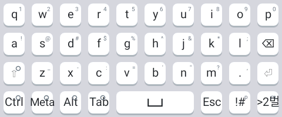

**Dvorak** — the same bottom row, its own 7/10/9 letter block:

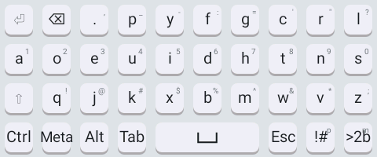

**Colemak** — the same bottom row, the letters in Colemak's places, backspace top right:

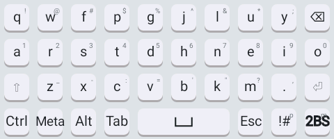

**Spanish** — ñ on the home row, backspace below it, the period beside space with `, ¿ ¡`:

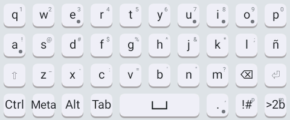

**Portuguese**, **Italian**, **Polish**, **Vietnamese**, **German** (y/z swapped) and **Turkish** keep QWERTY's
shape and hold their own letters; Vietnamese types through Telex:

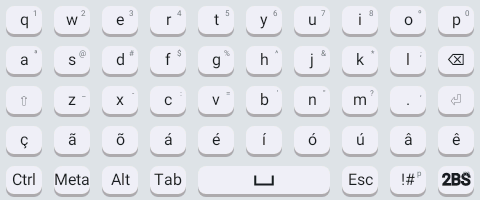

**Holding a key with several characters under it** raises a strip on the row above — beside the key
on the top row, and always towards the side with room, so no key ever asks for a slide off an edge.
Lift without moving and the first character types (the digit or symbol the key has always held);
slide along the strip and lift on the one you want. A dot in the key's bottom corner says there is
a strip:

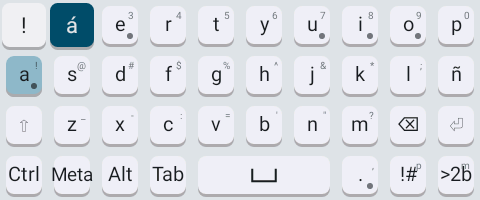

**French AZERTY** — its own 10/10/6 shape, and the strip that makes fifteen accents workable:

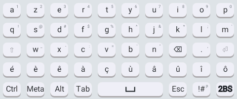

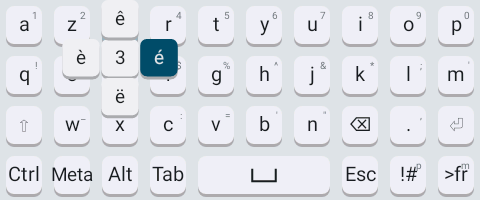

**Cheonjiin(천지인)** — Next beside Alt, 漢 beside Tab, and `.,` `!?` either side of ㅇㅁ:

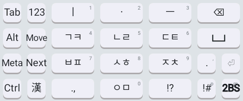

**Naratgeul(나랏글)** — 획 and 쌍 on the bottom letter row, 漢 beside Tab:

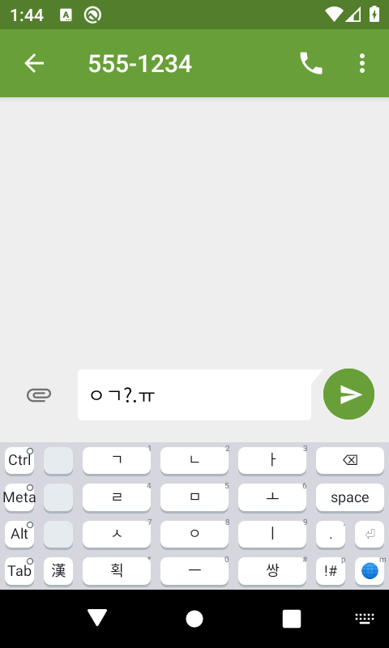

**Arrows** — the cursor cluster as a layout of its own:

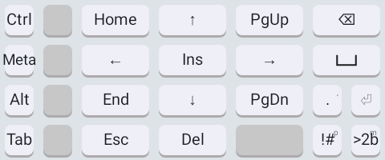

**Keypad** — the digits on a tap, the calculator set on hold:

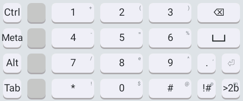

The two cells beside Tab turn the twelve Hangul keys into the phone keypad's digits, or into the
cursor cluster, and back again:

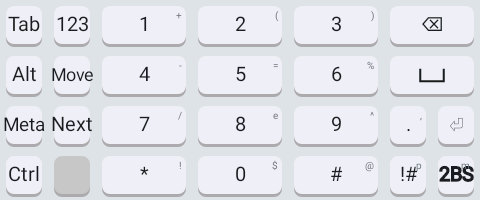

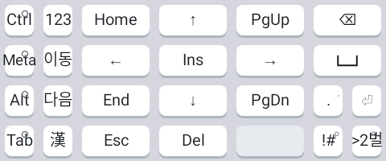

The `!#` key opens the special-characters page, where every key commits its symbol. Holding a key
types its alternate immediately — there is no popup to aim at and nothing to drag to. The top row
holds the digits it shares keys with on a physical keyboard, so `!` holds **1** and `)` holds **0**;
`;` holds a comma and `:` a full stop; holding `_` types `-`. `Esc` sits beside the space bar:


**Holding `!#`** opens the special-keys page: a right-hand keypad plus the special keys. It opens
with `Num` **on**, showing digits — num lock means digits here as it does on any keyboard. The
digits and `+ - = .` commit text; `Esc`, `Prt`, `Scr`, `Brk` and `Menu` send key events:


Turning `Num` **off** swaps the keypad for arrows and navigation — Home/End, PgUp/PgDn, Ins, and
forward-delete:

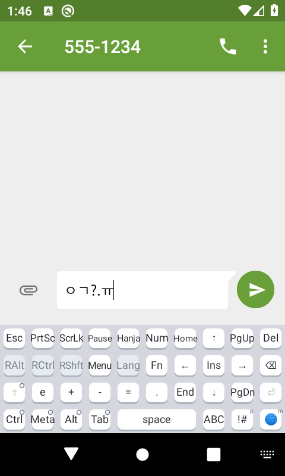

`Fn` swaps the whole page to the function and media keys. F1–F12 send key events; F13–F15 (which
have no Android key code), the media keys and Back stay muted:


### The menu page

**Holding the layout key** opens it. The right half is the editing hand — copy, cut and paste down its near
edge, the arrows in a cross with select-all at their centre, the jump keys around them, and
settings in the corner a thumb reaches without looking. The left half is everything about the
keyboard itself.


| | Key | Does |
|---|---|---|
| Undo | undo | undo the last edit |
| Redo | redo | redo it |
| Date | date | insert the current date and time as text |
| Emoji | emoji | *not built yet — drawn muted* |
| Clip | clipboard | *not built yet* |
| Copy | copy | copy the selection |
| Cut | cut | cut the selection |
| Paste | paste | paste the clipboard |
| SelA | select all | select everything in the field |
| Size− / Size+ | height | shrink or grow the keyboard by two percentage points a press, remembered per orientation |
| Switch | switch keyboard | open the system input-method picker |
| Manage | manage keyboards | open the system screen for enabling keyboards |
| Flt | floating | turn the floating panel on or off |
| 1Hand / Full | one-handed | *not built yet* |
| Theme | theme | walk the colour scheme: system → light → dark |
| ★1 / ★2 | custom | *not built yet* |
| Set | settings | open ReteKey's own settings |
| ← ↑ → ↓ | arrows | move the cursor; they repeat when held |
| Home / End | line ends | jump to the start or end |
| PgUp / PgDn | page | jump a page |
| Ins | insert | the Insert key |
| Del | forward delete | delete forward |
| 0 / F10 / Del | beside space | whatever the current mode is missing: the keypad's zero, the tenth function key, forward delete |

The muted keys are drawn but do nothing: they are the places the features will go, marked so the
page does not shift under you when they arrive.

## Floating keyboard

The menu page's **❐ floating** key turns the keyboard into a translucent panel that floats over the
app instead of docking to the bottom edge — the shape a tablet in landscape wants, where a
full-width keyboard is both too wide to type on and too tall to see past.

The panel is confined to one half of the screen, and which half that is follows the screen's
shape: a screen wider than it is tall splits left and right, and a screen taller than it is wide
splits top and bottom. Halving a phone held upright down the middle would leave two columns too
narrow to type in, and halving a tablet held sideways across would leave two strips too short to
read, so the panel always takes the half worth having. The other half stays yours. Its title bar carries, left to right:

| Key | Does |
|---|---|
| ☰ | drag to move the panel, anywhere within its half |
| ‹ / › | send the panel to the other half, mirrored about the centre line |
| ✕ | leave floating mode and go back to the ordinary keyboard |
| ⇲ | drag to resize the panel |

Dragging stops at the centre line: crossing over is the arrow key's job, and it reflects the panel
rather than dropping it somewhere new, so a panel hugging the left edge comes back hugging the
right one. Everything outside the panel still belongs to the app — the keyboard takes no touches
there and the app is not resized to make room for it. The mode and the panel's placement are
remembered, and a rotation rescales the panel instead of stranding it off-screen. How solid the
panel is, is yours to set — the opacity slider in settings runs from barely-there to fully solid.

## Notepad

The menu page's **Memo** key opens a notepad above the keyboard. The window takes the whole screen
while it is open, and everything above the keys is the note — translucent, so the app you are
copying from is still readable behind it. What you type goes into the note rather than into that
app, Hangul included: the notepad composes syllables itself.

A note's **first line is its stamp and its title**: `20260713-1448`, written the moment the note is
made and never edited, with the title beside it. Everything from the second line down is the body,
and **select all** takes the body alone — the line that names the note is not something anyone
means to select.

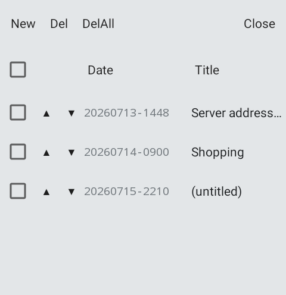

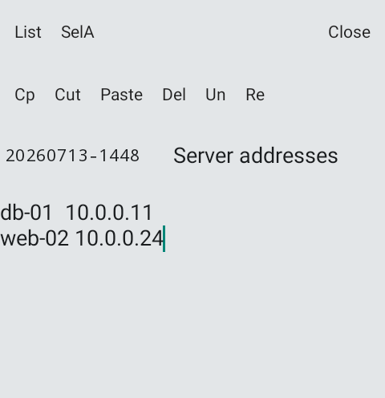

The list behaves like a file manager's details view:

| | |
|---|---|
| **Date** / **Title** | press a column to sort by it; press it again to turn the sort around (▲ ▼ shows which) |
| checkbox | one per row, and one in the header that takes all of them or none |
| ▲ ▼ | move a note up or down, for an order of your own |
| **New** | start a note, stamped now |
| **Del** / **DelAll** | delete the ticked notes, or every one |
| **List** | back to the list from a note; **Close** puts the keyboard back |
| **Cp Cut Paste Del Un Re** | copy, cut, paste, delete, undo, redo — on the selection, or on the whole field when nothing is selected. Undo is the notepad's own, so it works the same on Android 4 as on 16 |
| pinch | two fingers set the text size on either screen, from 60% to 300%, and it is remembered |

The links sit on one row and wrap onto a second only when the screen is too narrow for them all,
rather than running off the edge.

Notes are kept in the keyboard's own storage and written through on every change, because a
keyboard can be torn down between two keystrokes.

## Hanja conversion

Pressing the 한자 key — the one on the special-keys page, or a physical key you assigned — converts
Korean to Hanja:

- With a **selection**, the whole selection is converted.
- With **no selection**, the reading immediately before the cursor is converted, preferring the
  longest match, so `학교` becomes `學校` rather than converting `교` alone.
- Pressing it on **Hanja** converts back to its reading, including whole Hanja words.

Candidates appear in a floating panel of their own, in a paged grid of nine, with each 훈음 gloss
beside its character (家 집 가), wrapping onto a second line when the column is narrow. Drag the
panel by its bar, resize it, and it is as see-through as your floating keyboard's opacity setting
says — it is the same frame. It replaces the keyboard while it is up and gives it back afterwards,
and it comes up the same way when an external keyboard is doing the typing with no keyboard on
screen at all.


Tap a candidate, or press its number key **1**–**9**; `‹`/`›` in the header — or `←`/`→` and
`PageUp`/`PageDown` on a keyboard — turn the page, and **✕** leaves without converting, as `Esc`
does. What you typed stays as you typed it: it is a way out, not an undo.

The dictionary is bundled and searched where it lies: the tables are sorted files, memory-mapped
out of the APK and bisected per lookup, so they cost the Java heap nothing and the kernel is free to
drop their pages under memory pressure. Parsing the same data into hash maps used to cost about
2.6 MB of heap. See [THIRD_PARTY_NOTICES.md](THIRD_PARTY_NOTICES.md) for provenance and licences.

### Special characters, and any character at all

A consonant on its own followed by the Hanja key opens the row of symbols that consonant has stood
for since the KS X 1001 tables — ㅁ the general symbols, ㅅ the Greek alphabet, ㅇ the circled
numbers, ㄹ the units, ㄷ the mathematics, ㄴ the brackets, and so on for all fourteen. They arrive
in the same candidate window as Hanja, and each one is glossed with its code point, since a symbol
has no reading and the number is what you would look it up by.

For a character with no key and no consonant to reach it, the menu page's **Uni** key opens a code
point entry. It is a floating panel over what you are writing — drag it, resize it, and it is as
see-through as your floating keyboard's opacity setting says:

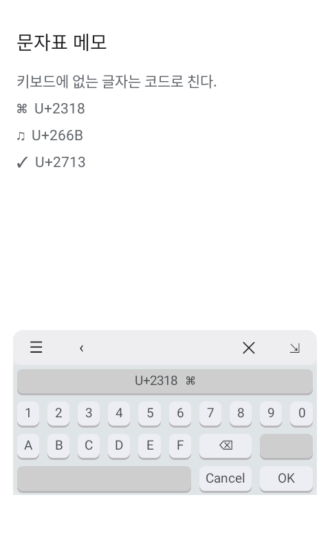

Type hex digits, up to six of them, so everything to U+10FFFF is within reach; the code and the
character it names are shown along the top. The pad is two rows: the digits, then **A**–**F** with
**Bksp**, **Cancel** and **OK** beside them. Nothing is typed until **OK**, because the code is a
composition — so **Cancel**, or the panel's ✕, leaves at any point with the document untouched and
the previous keyboard back on the layout you left it. With a hardware keyboard the panel comes up
just the same, and the digits, backspace, Enter and Esc all work from the physical keys. A physical
key can be bound to the entry itself in settings — none, one, or several, as with 한/영 and 한자.

## Physical keyboards

With a Bluetooth or wired keyboard, letter keys are mapped to 2-beolsik jamo while Korean mode is
on. In settings you can assign **several physical keys per function**:

- **KO/EN toggle** — for example `Shift+Space` *and* `Right Ctrl`.
- **Hanja** — for example `F9` *and* `Right Alt`.
- **Unicode entry** — opens the `U+` code point entry; hex digits build the character, Enter
  commits it, Esc leaves.

A binding may be a lone key or a modifier chord; a modifier pressed on its own registers as itself.
Modifier chords the IME does not claim are passed through, so application shortcuts keep working,
and a soft `Ctrl` plus a letter sends a real chord — terminals receive the control code, editors
run select-all/copy/paste/undo.

## Settings

The settings screen uses stock controls only and follows the system theme:

- **Colour scheme** — System, Light, or Dark. System is the default and follows the device; the other two hold whichever you pick, for the keyboard and for the app's own screens alike. On Android 12+ the colours themselves still come from the system's Material You palette.
- **Which screen these settings are for** — height, the layouts and their order, and the floating keyboard are **remembered separately for portrait and landscape.** Pick which one you are setting at the top of the screen, without having to turn the device to reach it.
- **Keyboard height** — how much of the screen's height the keyboard takes, from 1% to 50%. The number on the slider is the number on the screen: 25% is a quarter of it. A keyboard set before this was a percentage keeps exactly the size it had.
- **Floating keyboard** — whether to use it on this screen, and how solid it is (1–100%).
- **Key-press feedback** — visual, vibration, and sound strengths, each 0–100% (30, 10 and 10 by default).
- **Key auto-repeat** — on/off, start delay, and repeat interval.
- **Physical keyboard shortcuts** — register and remove KO/EN and Hanja keys.

A **Back to main screen** button at the top returns to the app's main screen at any time.

## The action bar

Off by default. It has a screen of its own — **Action bar settings**, from the app's main screen or
from the button in settings — where you turn it on and decide what it carries. Drag a row by its
**≡** handle to order it, nudge one with **▲ ▼**, take one off with **✕**, and **Default order** puts
the shipped bar back. It sits above the keys and scrolls sideways when the list is longer than the
screen.

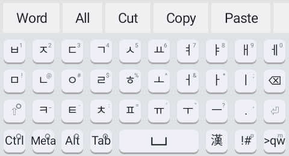

Stage one carries the things that need nothing remembered:

| Slot | What it does |
|---|---|
| **Word** | selects the word around the cursor — the run between spaces or punctuation, in Korean as in English |
| **All** | select all |
| **Cut** / **Copy** / **Paste** | the editor's own three |
| **← → ↑ ↓** | move the cursor |
| **Home** / **End** / **PgUp** / **PgDn** | jump |
| **Clip** | the clipboard list, below |
| **Sym** | the symbols page, from wherever you are |
| **Memo** | raises the notepad |

Two kinds of slot are yours to make:

- **Text** — anything you type into the box: a signature, an address, a command you keep retyping. A
  tap types it, and **holding it repeats**, the way holding a key does.
- **Key combination** — modifiers plus a key: Ctrl+B, Alt+F4, Esc on its own. A tap sends it once,
  and **holding presses the key and leaves it down** until you press the slot again, which is how
  Shift stays held for a selection.

Give either one a label and that is what the bar says; leave it blank and it shows the text itself,
or the combination's name.

Macros are the stage after this one.

**Word** needs the editor to say where the cursor is. A few — some terminals — never do, and there
the button does nothing rather than selecting the wrong thing.

### The clipboard list

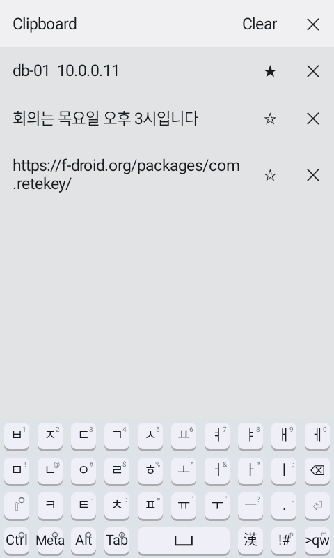

**Clip** opens what the keyboard remembers of what was cut and copied *through its own bar*. Tap a
clip to paste it; ☆ pins it so it is never aged out; ✕ forgets one and **Clear** forgets all the
unpinned ones.

What it will not do matters as much as what it will:

- **Nothing is recorded from a password or other sensitive field.** Those must not survive the
  keystroke, and a clipboard list is exactly where they would.
- Twenty unpinned clips are kept, newest first; pinned ones do not count towards that.
- Copying the same thing twice moves it up rather than storing it twice.
- A clip longer than 4000 characters is truncated: this is for pasting a line back, not for storing
  a document.
- It lives in the app's own private storage, and nothing is sent anywhere.

## Theming

The keyboard resolves its colours from the device theme rather than hardcoding them:

- The user's own choice comes first: **System, Light or Dark**, set in the settings screen or by
  the menu page's **Theme** key, which walks the three in turn.
- Left on System, the device's light/dark mode is honoured (`Configuration.UI_MODE_NIGHT_MASK`).
- Colours are assigned by Material role — background as surface, keys as an elevated surface,
  labels as on-surface, active keys as primary, and the press effect as a primary state layer.
- On Android 12+ the user's **Material You** palette is used, so the keyboard matches their theme;
  older versions fall back to a tuned light/dark palette.

The keys, the long-press popup, the Hanja candidate window, and the floating panel all share
one palette. The launcher and settings screens follow the same choice through the platform's own
DeviceDefault themes, so a forced light or dark applies to the whole app.

## Android version support

There are two builds of the same app. Install whichever your device takes; they carry the same
package name, so one replaces the other.

| Build | Runs on | APK |
|---|---|---|
| **modern** | Android 9 – 16 (API 28–36) | `retekey.apk` |
| **legacy** | Android 4.0 – 16 (API 14–36) | `retekey-legacy.apk` |

Both are built from the same source, target API 36, and behave identically wherever the platform
lets them. The split exists because reaching down to Android 4 means taking an older road in a few
places, and there is no reason to make a current phone take it.

### What the legacy build does differently

Three things, all of them on the device's side of a version check rather than in a separate
codebase:

| On older Android | What happens | From |
|---|---|---|
| Vibration | one fixed strength instead of a strength dial — `VibrationEffect` is API 26, and the older call only takes a duration | below API 26 |
| Sliders | the keyboard-height and opacity sliders run from zero internally and are offset — `SeekBar.setMin` is API 26 | below API 26 |
| Deletion | code-point deletion is not available, so the UTF-16 fallback already used for older editors handles it; a syllable or emoji still disappears in one press | below API 24 |
| Shadows | the Hanja window has no drop shadow — `PopupWindow.setElevation` is API 21 | below API 21 |
| Theme | the screens use the platform's own DeviceDefault rather than Material | below API 21 |

| Panel bar | the floating panel's bar says `Menu` `<` `>` `X` `Size` in words where the modern build draws ☰ ‹ › ✕ ⇲ — the glyph font those come from arrives with API 21 | below API 21 |

Everything else — the five layouts, the 2-beolsik and 12-key composers, Hanja conversion, the
floating keyboard, physical keyboards, auto-repeat, theming — is the same code on both. The app
uses no `java.time`, no `java.util.function`, and no library desugaring, which is why the legacy
APK is *smaller* than the modern one rather than larger.

#### The notepad and the code-point entry, on old Android

Both work in full on the legacy build, and this is worth spelling out because both are the kind of
feature that usually needs a newer platform.

**The notepad (Memo)** — every part of it: the list with its sortable columns, the checkboxes and
the header one that takes all of them, the ▲▼ reordering, delete and delete-all, the forced stamp
line and the title beside it, writing Hangul into the note through the keyboard's own composer, and
the second row of editing links (`Cp` `Cut` `Paste` `Del` `Un` `Re`). Nothing in it is gated on a
version. Two details are worth naming:

- **Undo and redo are the notepad's own.** `TextView`'s built-in undo is API 23, which the legacy
  build cannot use, so the notepad keeps a history of its own — the same sixty steps, the same
  behaviour, from Android 4.0 upward.
- **The clipboard** goes through `ClipboardManager.setPrimaryClip`, which has been there since
  API 11, so copy, cut and paste move text between the notepad and other apps exactly as on a new
  phone.

The one difference is invisible: the note fields ask the system not to raise a keyboard over them
(`setShowSoftInputOnFocus`, API 21). Below that the call is skipped — and nothing happens anyway,
because an IME window holds no system focus for a keyboard to be raised into.

**Direct code-point entry (Uni)** — works in full: the floating pad, up to six hex digits, `OK`
committing and `Cancel` leaving with the document untouched, the same from a hardware keyboard.
Codes above U+FFFF are inserted correctly as surrogate pairs; whether you then *see* the character
is the device font's business, and an Android 4.4 phone has no glyph for most emoji or for the
later CJK extensions, so it will show a box while holding the right character. Paste it somewhere
with a fuller font and it is there. The pad's own labels are all ASCII, so they draw everywhere.

**Hanja conversion** is the same code on both builds too, including the floating candidate panel.

The two pictures below are the real views drawn by the legacy APK on an Android 4.4.2 image — the
notepad with both rows of links, and the code-point pad in its floating frame. They also show the
two limitations named above: the panel bar reads `Menu < X Size` in words, and the character beside
`U+2318` is missing because that font has no glyph for it, though the code point itself is what
gets typed.

| | |
|---|---|
| 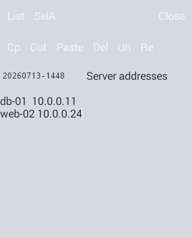 | 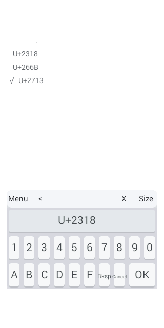 |

Android 4.0 is where it stops, and the reason is structural rather than stubborn. Below API 11
there is no `InputMethodSubtype` (so no 한/영 mode), no `KeyEvent.isCtrlPressed` or F-key codes (so
no physical-keyboard support), no `Insets.touchableRegion` (so no floating keyboard); below API 9
there is no `getSelectedText` (so no Hanja on a selection) and no `MotionEvent.getActionMasked`.
Reaching Android 2 would not be a port of this keyboard; it would be a different, much smaller
one.

Android 12 (API 31) and newer still take the Material You palette on both builds; below it, both
fall back to the tuned light/dark palette.

### The legacy build, on Android 4.4

These are screencaps from a KitKat emulator running the legacy APK — not renders, and not the
modern build with an older label on it.

| | |
|---|---|
|  |  |
| 2-beolsik with its hold alternates, on a 2013 platform | the Hanja window: full keyboard width, 훈음 beside each character, six pages |
|  |  |
| the ☰ page: editing and cursor keys on the right, settings in the corner | settings, reached from that corner key |

The labels read as words rather than glyphs here, and that is the legacy build doing its job: a
screenshot of an earlier attempt showed the menu key as an *empty cell*, because Android 4.4 has no
font for ☰. Below the version where those glyphs became dependable, the keys say `Menu`, `Copy`,
`Bksp`, `Lang` instead of drawing nothing.

### What has actually been run

| | Version | How |
|---|---|---|
| Verified by an automated lane | Android 13 — API 33 | AOSP x86_64 emulator, IME lifecycle test |
| Verified by hand | Android 13 — API 33 | Galaxy Note20, the project's primary device |
| Verified by hand | Android 13 — API 33 | the legacy build, on the same emulator |
| Verified by hand | **Android 4.4 — API 19** | the legacy build on a KitKat emulator: Korean types, 한자 converts, settings opens |

The rows above are the versions an actual run has covered. The rest of each range is supported by
construction: every platform call the app makes exists at that build's floor, and the ones that do
not are behind an explicit version check. Lint agrees at both floors, with no errors.

## For developers

Nothing in this part is needed to use the keyboard.

### Architecture

The app uses Android's standard `InputMethodService` entry point. The input core is deliberately
Android-free so it can be unit-tested on the JVM: event normalisation, semantic jamo, the 2-beolsik
hardware mapping, dispatch disposition, immutable transition plans, checked editor execution,
Unicode-safe deletion, the Hanja tables, and the key-repeat and shortcut settings.

Cursor state follows the AOSP LatinIME model: a passive cache that the editor's own
`onUpdateSelection` always overrides, tolerating unknown (`-1`) selections. The keyboard never
refuses input because its idea of the cursor disagrees with the editor's.

The keyboard is drawn on a canvas. The unpressed keyboard is rendered once into a cached bitmap and
reused until the layout, highlight state, size, or theme changes; a key press only tints one key, so
the raised styling costs nothing per frame. That cache is `RGB_565` — the keyboard is opaque, so it
needs no alpha channel, and half the bytes per pixel matters on a tablet.

- Java / JDK 21 (the toolchain the F-Droid buildserver provides; bytecode target 17)
- Android SDK 36 (`targetSdk 36`; `minSdk 28` modern, `minSdk 14` legacy)
- Android Gradle Plugin 9.2.1, Gradle wrapper 9.4.1
- R8 minification; no third-party runtime libraries

### Build

Local builds require JDK 21 and Android SDK platform 36 with Build Tools 36.0.0. Use the checked-in
wrapper rather than a system Gradle:

```sh
./gradlew testModernDebugUnitTest assembleModernDebug   # Android 9+
./gradlew assembleLegacyDebug                            # Android 4.0+
```

A signed release build additionally needs a local `keystore.properties`; without it the release
variant is simply unsigned.

### Android IME implementation manual

**[English](docs/android-ime-manual.md)** · [한국어](docs/android-ime-manual.ko.md)

A manual for building an Android input method: how an IME is put together, a minimal working one
you can copy, the reference implementations worth reading, and then the parts that are hard — each
with the failure from this project that shaped it.

It covers:

- **how an IME is structured** — the service, `method.xml`, input and candidates views, how the
  system finds/enables/selects it, and the data flow from a touch to the editor;
- **a minimal working IME** — manifest, `method.xml`, and a service you can paste and run, plus the
  order in which to grow it;
- **reference implementations and where to get them** — AOSP LatinIME and the `SoftKeyboard`
  sample, with clone commands and what to read in each;
- the `InputMethodService` lifecycle, including the **real measured teardown order**, which is not
  the tidy one the documentation implies;
- the `InputConnection` contract, and why insertion and relative deletion never need to know the
  cursor position;
- **the editor is authoritative** — the passive cursor cache that follows from it, and why a
  keyboard must never refuse input over its own bookkeeping;
- editor kinds: terminals (`TYPE_NULL`, selection `-1`) and everything that breaks in them;
- composing text, hardware keyboards and modifier chords, and the candidates view;
- drawing a custom keyboard cheaply, theming it to the system and Material You palettes, and
  keeping settings live on a running keyboard;
- what a headless emulator can and cannot prove about an IME;
- **a detailed anti-pattern chapter** — real failures from this project, each with what was
  built, what went wrong, the fix, and the resulting rule, with wrong-versus-right code;
- a pre-release checklist.

The English version is canonical and the Korean version is its translation; the two link to each
other. It is a **living document**, updated whenever ReteKey's IME implementation changes, so it
describes working code rather than intentions.

Design RFCs, the verification catalog, decisions, and the changelog live in a private companion
repository and are not part of this public surface.

## The name

**rete** is Latin for *net*, and *-key* is just a key.

The intended pronunciation is the Latin one: **RAY-teh** (two syllables, `rē-te`; the first vowel is
the long *e* of *they*, and the final *e* is pronounced, never silent).

If you would rather say it the way English usually treats this word, that is fine too. English
borrowed *rete* as an anatomical term and pronounces it **REE-tee**, so "REE-tee-key" is a
perfectly good reading. Say it however you like; the keyboard does not mind.

## License

MIT — see [LICENSE](LICENSE). Bundled third-party data and ported code are credited in
[THIRD_PARTY_NOTICES.md](THIRD_PARTY_NOTICES.md).
